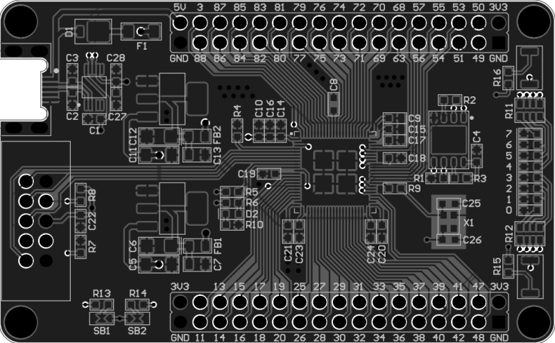

# BOARDS
| Name | Info | Image |
| --- | --- | :---: |
| [Altera10M08Eval](riocore/boards/Altera10M08Eval/README.md) |  |  |
| [Arty-a7-35t](riocore/boards/Arty-a7-35t/README.md) |  |  |
| [Basys2](riocore/boards/Basys2/README.md) |  |  |
| [Colorlight5A-75E](riocore/boards/Colorlight5A-75E/README.md) |  |  |
| [Colorlight_i5-v7_0](riocore/boards/Colorlight_i5-v7_0/README.md) |  |  |
| [ICEBreakerV1.0e](riocore/boards/ICEBreakerV1.0e/README.md) |  |  |
| [IceShield](riocore/boards/IceShield/README.md) |  |  |
| [MecanixDev](riocore/boards/MecanixDev/README.md) |  |  |
| [OctoBot](riocore/boards/OctoBot/README.md) |  |  |
| [Olimex-ICE40HX8K-EVB](riocore/boards/Olimex-ICE40HX8K-EVB/README.md) |  |  |
| [Spartan6](riocore/boards/Spartan6/README.md) |  | |
| [TangNano20K](riocore/boards/TangNano20K/README.md) |  |  |
| [TangNano9K](riocore/boards/TangNano9K/README.md) |  |  |
| [TangPrimer20K](riocore/boards/TangPrimer20K/README.md) |  |  |
| [Tangoboard](riocore/boards/Tangoboard/README.md) |  |  |
| [iceWerx-iCE40-HX8K](riocore/boards/iceWerx-iCE40-HX8K/README.md) |  |  |