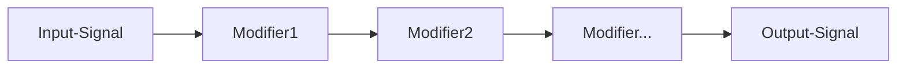

# MODIFIERS
you can modify each input and output pin of the FPGA with an modifier pipeline

## OnError
holds the pin on error

**Options:**
| Name | Type | Default | Info |
| --- | --- | --- | --- |
| Invert | bool | False |  |

## Debounce
filter noisy signals

**Options:**
| Name | Type | Default | Info |
| --- | --- | --- | --- |
| Delay | int | 16 |  |

## PWM
pwm generator

**Options:**
| Name | Type | Default | Info |
| --- | --- | --- | --- |
| Frequency | int | 16 |  |
| DTY | int | 50 |  |

## Oneshot
creates a variable-length output pulse when the input changes state

**Options:**
| Name | Type | Default | Info |
| --- | --- | --- | --- |
| PulseLen | float | 1.0 | pulse len in ms |
| Retrigger | bool | False | retrigger the time pulse |
| Hold | bool | False | hold the puls while input is set |
| Edge | select | RISING | edge to trigger |

## Toggle
toggle pin on rising edge

## Invert
inverting the pin

