# PLUGINS

| Type | Name | Info | Image |
| --- | :---: | --- | :---: |
| Interfaces | [arty_mii](riocore/plugins/arty_mii/README.md) | udp interface for host comunication - experimental - Arty7-35t only | 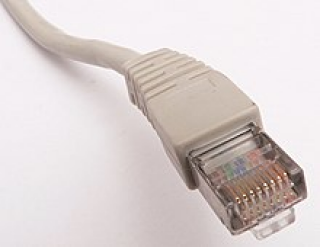 |
|  | [rmii](riocore/plugins/rmii/README.md) | rmii udp interface (experimental) |  |
|  | [spi](riocore/plugins/spi/README.md) | spi interface for host comunication | 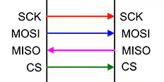 |
|  | [uart](riocore/plugins/uart/README.md) | uart interface for host cominucation | 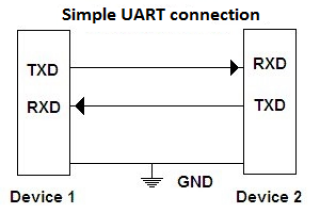 |
|  | [w5500](riocore/plugins/w5500/README.md) | udp interface for host comunication | 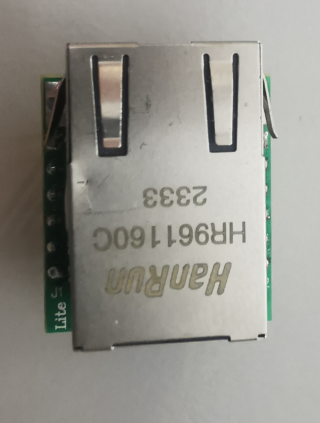 |
| Joints | [pwmout](riocore/plugins/pwmout/README.md) | pwm output | 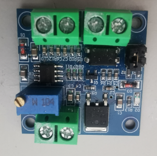 |
|  | [rcservo](riocore/plugins/rcservo/README.md) | rc-servo output | 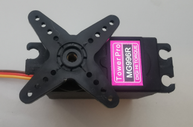 |
|  | [stepdir](riocore/plugins/stepdir/README.md) | step/dir output for stepper drivers | 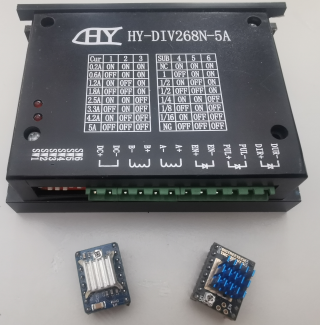 |
|  | [stepper](riocore/plugins/stepper/README.md) | stepper driver output for H-Bridges like L298 | 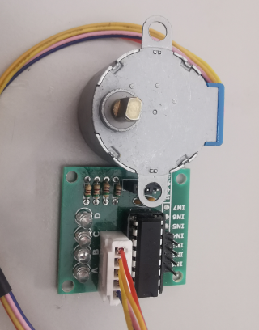 |
| IO | [ads1115](riocore/plugins/ads1115/README.md) | 4-channel adc via I2C | 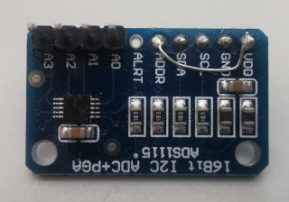 |
|  | [as5600](riocore/plugins/as5600/README.md) | magnetic absolute encoder | 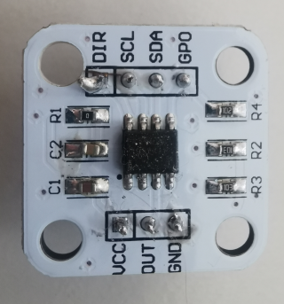 |
|  | [bitin](riocore/plugins/bitin/README.md) | single input pin | 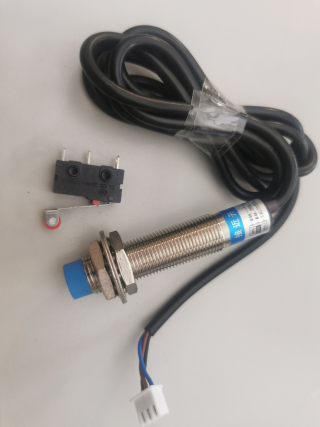 |
|  | [bitout](riocore/plugins/bitout/README.md) | singe bit output pin | 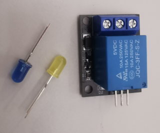 |
|  | [blink](riocore/plugins/blink/README.md) | blinking output pin | 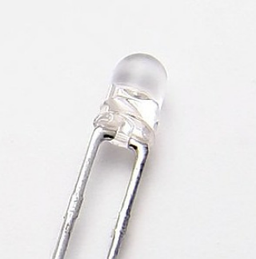 |
|  | [counter](riocore/plugins/counter/README.md) | pulse counter input |  |
|  | [dis7seg](riocore/plugins/dis7seg/README.md) | 7segment display with buttons | 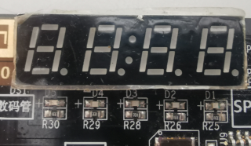 |
|  | [ds18b20](riocore/plugins/ds18b20/README.md) | 1Wire Temperature sensor | 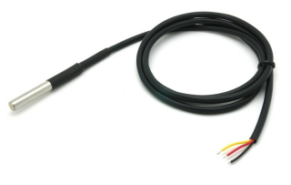 |
|  | [freqin](riocore/plugins/freqin/README.md) | frequency input | 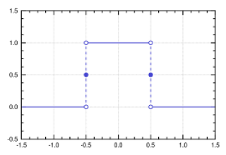 |
|  | [freqout](riocore/plugins/freqout/README.md) | frequency output |  |
|  | [hx711](riocore/plugins/hx711/README.md) | digital weight sensor | 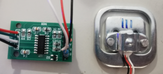 |
|  | [icewerxadc](riocore/plugins/icewerxadc/README.md) | 4-channel adc of the iceWerx-board | 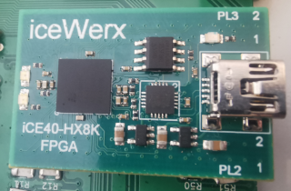 |
|  | [irin](riocore/plugins/irin/README.md) | IR-Remote input | 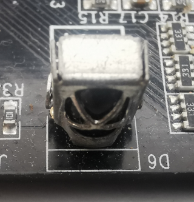 |
|  | [lm75](riocore/plugins/lm75/README.md) | I2C Temperature-Sensor | 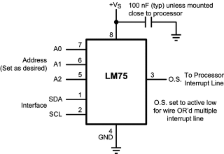 |
|  | [max10adc](riocore/plugins/max10adc/README.md) | MAX10 ADC inputs | 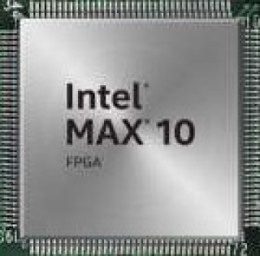 |
|  | [max6675](riocore/plugins/max6675/README.md) | SPI temperature sensor | 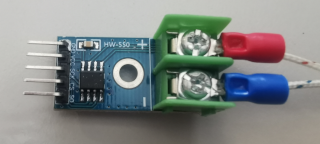 |
|  | [max7219](riocore/plugins/max7219/README.md) | 7segment display based on max7219 | 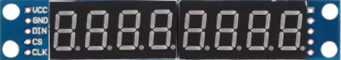 |
|  | [pwmin](riocore/plugins/pwmin/README.md) | pwm input |  |
|  | [quadencoder](riocore/plugins/quadencoder/README.md) | quadencoder | 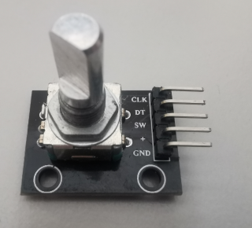 |
|  | [quadencoderz](riocore/plugins/quadencoderz/README.md) | quadencoder with index pin | 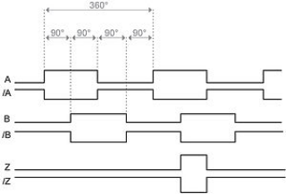 |
|  | [signal](riocore/plugins/signal/README.md) | virtual signal |  |
|  | [sonar](riocore/plugins/sonar/README.md) | sonar sensor for distance measurement | 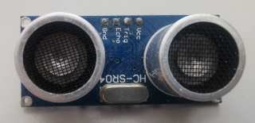 |
|  | [spipoti](riocore/plugins/spipoti/README.md) | spi digital poti | 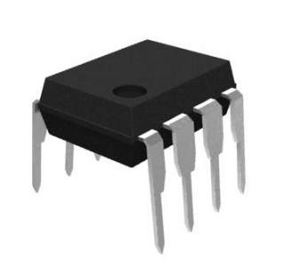 |
|  | [tlc549c](riocore/plugins/tlc549c/README.md) | spi adc input | 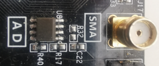 |
|  | [tm1638b8s7l8](riocore/plugins/tm1638b8s7l8/README.md) | 7segment display with buttons | 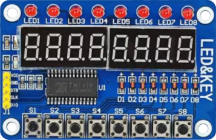 |
|  | [udpoti](riocore/plugins/udpoti/README.md) | digital-poti with up/down+dir interface |  |
|  | [wled](riocore/plugins/wled/README.md) | ws2812b interface |  |
|  | [wled_bar](riocore/plugins/wled_bar/README.md) | ws2812b interface for bar-displays |  |
| FrameIO | [modbus](riocore/plugins/modbus/README.md) | generic modbus plugin | 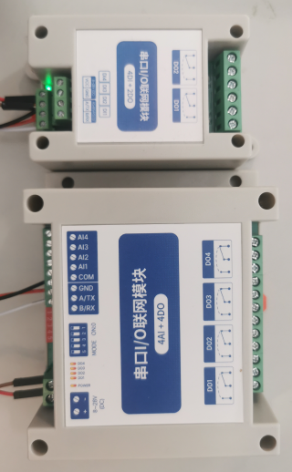 |
|  | [uartbridge](riocore/plugins/uartbridge/README.md) | uart bridge - experimental - python only |  |
| Expansions | [shiftreg](riocore/plugins/shiftreg/README.md) | Expansion to add I/O's via shiftregister's | 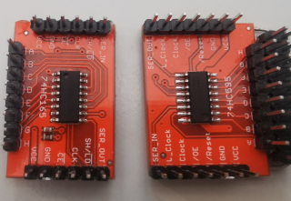 |
|  | [wled](riocore/plugins/wled/README.md) | ws2812b interface acting as an expansion port |  |
