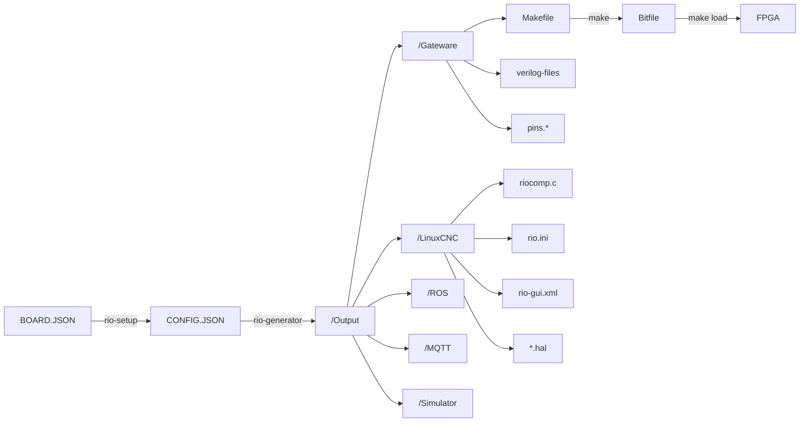

[LinuxCNC-RIO](https://github.com/multigcs/LinuxCNC-RIO) - rewrite

<h3 align="center">RIO</h3>

<div align="center">

  

  [](/LICENSE)

</div>

---

<p align="center"> Realtime-IO for Motion-Control <br></p>

## Table of Contents
- [About](#about)
- [Disclaimer](#disclaimer)
- [Help](#help)
- [Boards](#boards)
- [Plugins/Drivers](#plugins)
- [supported Toolchains](#toolchains)
- [Getting Started](#getting_started)
- [Usage](#usage)
- [Flow](#flow)

## About <a name = "about"></a>

RIO is a cost-effective and flexible alternative to traditional hardware setups like Mesa boards,
it's a code generator for using FPGA boards as Realtime-IO for LinuxCNC and other Motion-Control systems.

Furthermore, the complete configuration and hal is generated.
a json configuration file serves as the basis

* operates without a soft-core processor, relying solely on FPGA logic, which eliminates jitter and ensures fast, reliable performance
* It supports communication via SPI (e.g., with Raspberry Pi 4) or Ethernet, providing flexibility for different hardware setups
* Configuration is managed via JSON files, enabling easy customization of pin selection and other parameters. The tool automatically generates LinuxCNC configuration files (HAL/INI), saving significant setup time
* using free FPGA-Toolchain or commercial (depends on the FPGA)
* Compatible with a wide range of FPGA boards, including ICE40, ECP5, MAX10, Artix7, Gowin, CycloneIV, and TangNano9K, allowing users to choose hardware that fits their needs and budget
* Supports open and closed-loop control for multiple motor types (e.g., stepper motors, DC servos), as well as mixed joint configurations
* Primarily intended for LinuxCNC but also suitable for other systems such as ROS (Robot Operating System)

These features make RIO an attractive solution for hobbyists and professionals seeking a customizable, cost-effective Realtime-IO interface for Motion-Control systems


## DISCLAIMER <a name = "disclaimer"></a>
THE AUTHORS OF THIS SOFTWARE ACCEPT ABSOLUTELY NO LIABILITY FOR ANY HARM OR LOSS RESULTING FROM ITS USE.
IT IS EXTREMELY UNWISE TO RELY ON SOFTWARE ALONE FOR SAFETY.
Any machinery capable of harming persons must have provisions
for completely removing power from all motors, etc, before persons enter any danger area.
All machinery must be designed to comply with local and national safety codes,
and the authors of this software can not,
and do not, take any responsibility for such compliance

## Help <a name = "help"></a>

* [LinuxCNC-Forum (en)](https://forum.linuxcnc.org/18-computer/49142-linuxcnc-rio-realtimeio-for-linuxcnc-based-on-fpga-ice40-ecp5)
* [cnc-aus-holz (de)](https://www.cnc-aus-holz.at/)

## Boards <a name = "boards"></a>
list of all boards: [BOARDS](riocore/boards/README.md)

## Plugins/Drivers <a name = "plugins"></a>
list of all plugins: [PLUGINS](riocore/plugins/README.md)

## supported Toolchains <a name = "toolchains"></a>
list of all  toolchains: [TOOLCHAINS](riocore/generator/toolchains/README.md)

## Getting Started <a name = "getting_started"></a>

There are multiple ways of getting started. 

 1. Installer-Script (debian-bookworm only)  [installer](#installer).
 2. Install riocore on the linux  [host](#host).
 3. Use [docker](DOCKER.md).

### Installer-Script (debian-bookworm only) <a name = "installer"></a>
if you have a Debian-Bookworm installation (e.g. from the LinuxCNC ISO or the LinuxCNC raspberry image)
you can simply use this script to install all depends and the icestorm and gowin toolchain (gowin only on Intel/AMD)
```
wget -O- https://www.multixmedia.org/riocore-installer.sh | bash
```

### Install ricore on the host <a name = "host"></a>

- installing via git:
```
git clone https://github.com/multigcs/riocore.git
cd riocore
```

- installing dependencies via apt:
```
apt-get update
apt-get -y install python3 python3-pip python3-yaml python3-graphviz python3-pyqtgraph python3-pyqt5 python3-pyqt5.qtsvg python3-lxml python3-psutil
```

make sure that the toolchain matching your fpga is in the path:
```
export PATH=$PATH:/opt/oss-cad-suite/bin/
export PATH=$PATH:/opt/Xilinx/Vivado/2023.1/bin/
export PATH=$PATH:/opt/gowin/IDE/bin/
export PATH=$PATH:/opt/intelFPGA_lite/22.1std/quartus/bin/
export PATH=$PATH:/opt/Xilinx/14.7/ISE_DS/ISE/bin/lin64/
```

than copy a config file that is near to your setup:
```
cp riocore/configs/Tangoboard/config-spi.json my_config.json
```

## [DOCKER](DOCKER.md) (alternative)

Using a TangNano9k or other board supported by the open-cad-suite? Check out the docker setup for an easy to use all in one way to run the riocore ui and generator, including flashing: [DOCKER](DOCKER.md)


## Usage <a name="usage"></a>

you can edit your configuration file by hand (text-editor) or using the setup tool (rio-setup):
```
bin/rio-setup my_config.json
```


after setup, you can save your configuration and generate the output-files in the setup-tool via buttons:

* Generate : generates the output-files and write it into the './Output/' folder
* Compile: compiles the Bitfile for your FPGA
* Flash: writes the new bitfile onto the FPGA

you can also do this things on your console:

generate:
```
bin/rio-generator my_config.json
```
```
loading: my_config.json
loading board setup: TangNano9K
writing gateware to: Output/Tangoboard/Gateware
!!! gateware changed: needs to be build and flash |||
loading toolchain gowin
writing linuxcnc files to: Output/Tangoboard/LinuxCNC
```
compile:
```
(
cd Output/BOARD_NAME/Gateware/
make clean all
)
```

flash:
```
(
cd Output/BOARD_NAME/Gateware/
make load
)
```

You can find all the LinuxCNC related files in 'Output/BOARD_NAME/LinuxCNC/',

to start LinuxCNC, you have to install the rio component first:
```
sudo halcompile --install riocore/files/rio.c
```

then you can start LinuxCNC with your new .ini file:
```
linuxcnc Output/BOARD_NAME/LinuxCNC/rio.ini
```

> [!WARNING]
> all files will be overwritte by the generator tool
> 
> if you change the .ini file by hand, for example, you should make a copy of it
> 
> if you need an additional .hal file, you can incude it in the postgui_call_list.hal
> 
> rio will not overwrite this entry's
>


### Prerequisites
you need the toolchain for your FPGA or in some cases the https://github.com/YosysHQ/oss-cad-suite-build


## Flow <a name = "flow"></a>



## Directory Structure

```
riocore
├── bin ················ user tools / gui's
├── doc ················ documentation
├── dockerfiles ········ files to run the docker container
├┬─ ricore ············· main directory 
|├── boards ············ board configurations
|├── chipdata ·········· pin-information about the different FPGAs
|├── configs ··········· some demo configurations
|├── gui ··············· widgets and functions for the gui tools
|├── files ············· helper scripts and files
|├┬── generator ········ the generators for the GateWare and LinuxCNC configuration
||├── addons ··········· generator addons for LinuxCNC (like joystick/mpg/...)
||├── pins ············· the different pin generators, used by the toolchains
||├── toolchains ······· location of the different toolchain generators
|├── modules ··········· break out board and external modules configuration
|├── plugins ··········· location of the plugins
├── tests ·············· unit tests
```
