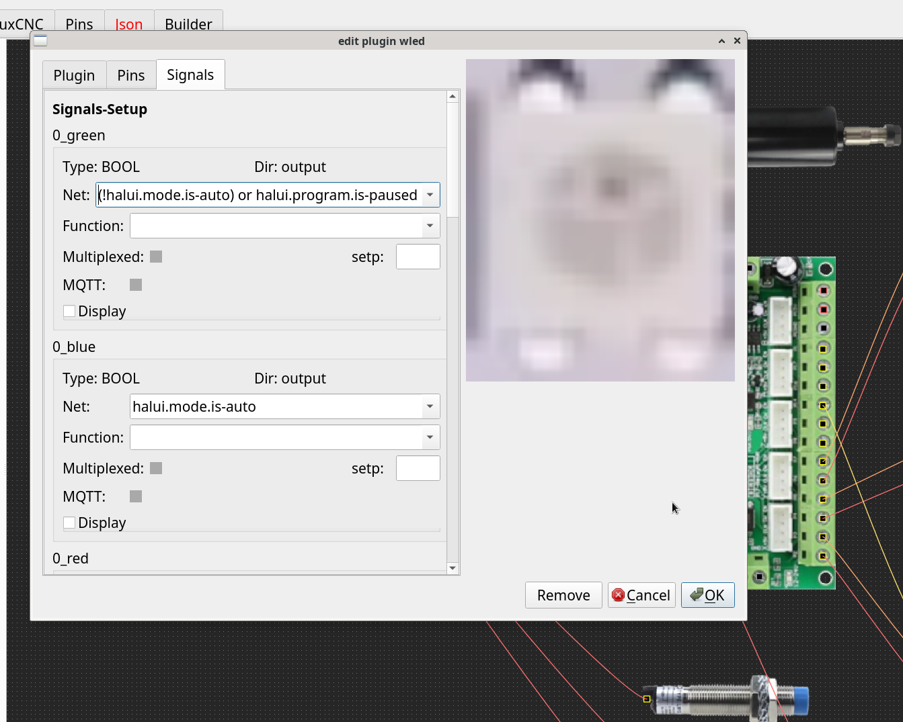
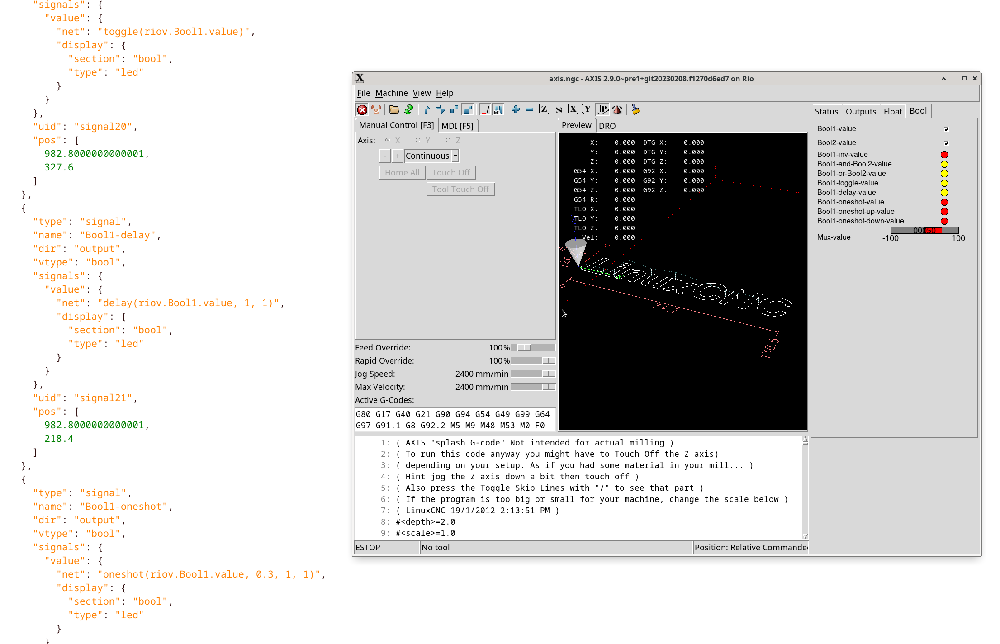

# Hal generator
The HAL generator has a few extra features designed to make life easier ;)

for output signals like this:




here are a few examples:

# bit/boolean
```
!halui.mode.is-auto
```
```
(halui.machine.is-on and motion.is-all-homed and !halui.mode.is-auto and !axisui.error) or halui.program.is-paused
```
```
toggle(riov.Bool1.value)
```
```
delay(riov.Bool1.value, 1, 1)
```
```
oneshot(riov.Bool1.value, 0.3, 0, 1)
```

# float functions:
```
limit(riov.Float1.value, -50, 50)
```
```
deadzone(riov.Float1.value, 0, 50)
```
```
abs(riov.Float1.value)
```
```
((riov.Float1.value + riov.Float2.value) - riov.Float2.value) * 5
```

# min and max value with reset pin
```
min(riov.Float1.value, riov.Reset)
```
```
max(riov.Float1.value, riov.Reset)
```

# bool to float
```
mux2(riov.Bool1.value, -50, 50)
```

# float to bool
```
riov.Float1.value < -20
```
```
riov.Float1.value > 20
```
```
riov.Float1.value <> -20,20
```

# demo config
you can start a little demo to play with (-> Tab float/bool):
```
rio-generator -S riocore/configs/haldemo/virtual-signals-axis-pyvcp.json
```




# adding own additional hal-files

you can add your own .hal files to the call_list's:
```
$ cat Output/Tangbob/LinuxCNC/pregui_call_list.hal
source my_own_pregui.hal
```
```
$ cat Output/Tangbob/LinuxCNC/postgui_call_list.hal
source custom_postgui.hal
source my_own_postgui.hal
```

these extra source entries are not removed during generation
