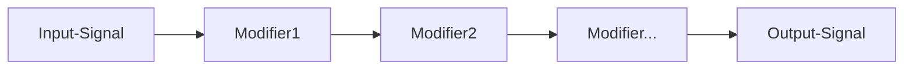
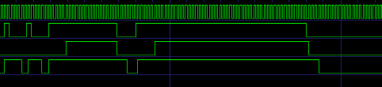
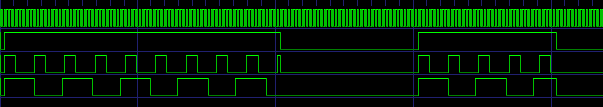
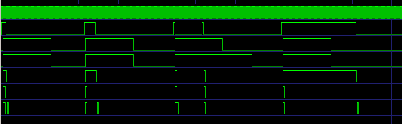
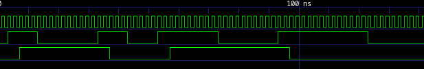

# MODIFIERS
you can modify each input and output pin of the FPGA with an modifier pipeline

## OnError
holds the pin at 0 when an error has occurred

**Options:**
| Name | Type | Default | Info |
| --- | --- | --- | --- |
| Invert | bool | False | Inverts the Logic |

## Debounce

to filter noisy signals

**Options:**
| Name | Type | Default | Info |
| --- | --- | --- | --- |
| Delay | float | 2.5 | Delay in ms |

## Delay

to delay signal edges

**Options:**
| Name | Type | Default | Info |
| --- | --- | --- | --- |
| Delay | float | 2.5 | Delay in ms |
| Rising-Edge | bool | True | do delay on rising edge |
| Falling-Edge | bool | False | do delay on falling edge |

## PWM

pwm generator

**Options:**
| Name | Type | Default | Info |
| --- | --- | --- | --- |
| Frequency | int | 1 | PWM Frequency |
| DTY | int | 50 | PWM Duty Cycle |

## Oneshot

creates a variable-length output pulse when the input changes state

**Options:**
| Name | Type | Default | Info |
| --- | --- | --- | --- |
| PulseLen | float | 1.0 | pulse len in ms |
| Retrigger | bool | False | retrigger the time pulse |
| Hold | bool | False | hold the puls while input is set |
| Edge | select | RISING | edge to trigger |

## Toggle

toggle pin on rising edge

## Invert
inverting the pin

