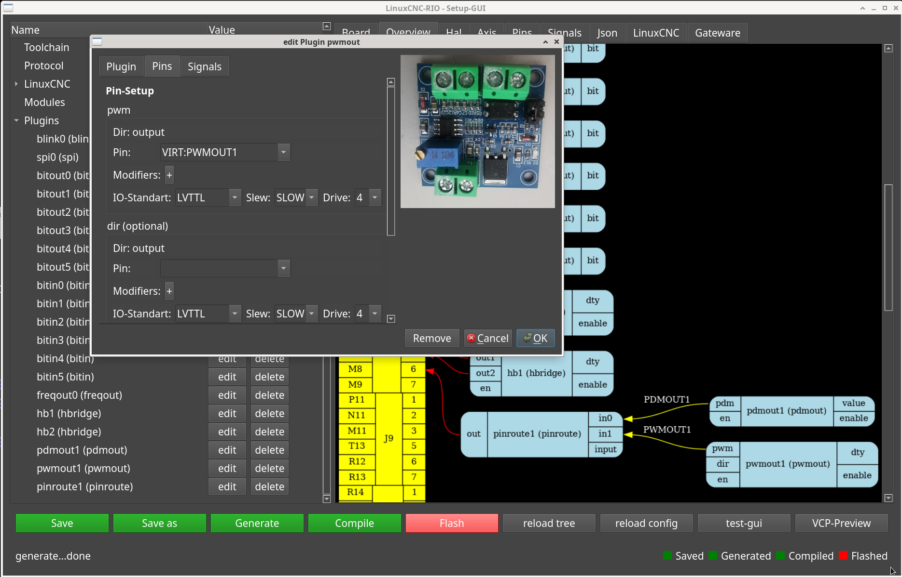

# Pins

the pins in rio are usually just the pin names of the FPGA

but there are also a few exceptions to map an extended configuration.

## pin mapping / slots

So-called slots are configured in some board configurations,
these are alternative names for groups of fpga pins.

Example:
the tangbob has an RGB led on the board,
to avoid having to remember the pin, this can also be configured as 'WLED:DATA'

the same board also has 2 ports for connecting external BOBs, these can simply be configured with their own pin names, e.g. LEFT:P12

## Virtual pins

as a 3rd option, you can also create four virtual pins to connect plugins internally, e.g. in plugin A the output pin and in plugin B the input port must be set to the same virtual port (like 'VIRT:MYA2B').

here is an example in the flowchart:

