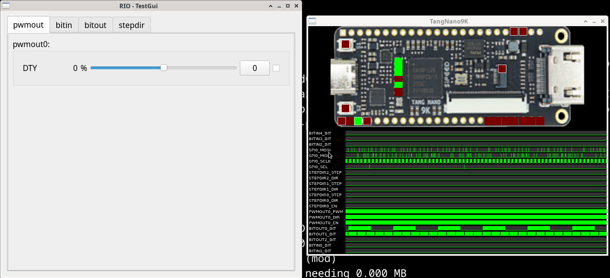
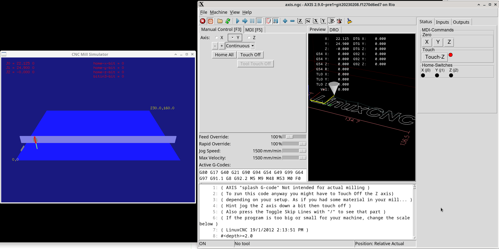
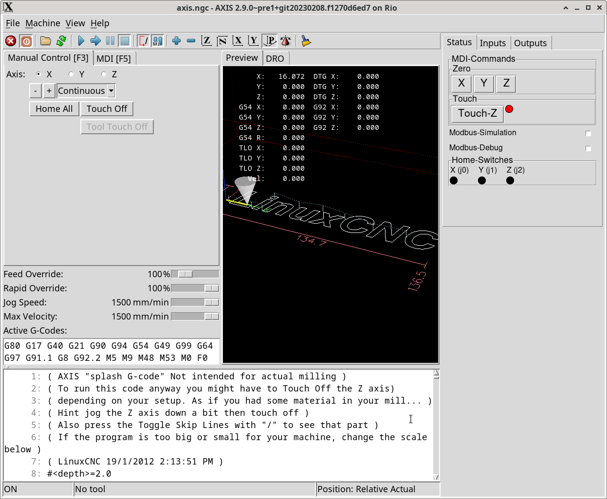

# Simulation

there are multiple ways to test/simulate your board config


## gateware simulation inside verilator


* to test the verilog code

to run the board simulation inside verilator with compiled verilog code
you can start your normal rio-config like this:
```
bin/rio-generator -v riocore/configs/TangNano9K/config-spi.json
```
in this mode, the python test-gui starts, its too slow for linuxcnc.

you need an spi interface to simulate the host-interface.


## udp client simulation in c


* to test the interface and your config

for this simulation type, you need an UDP interface in your config (e.g. w5500 plugin):
```
bin/rio-generator -U riocore/configs/Tangbob/config.json
```
for machine type 'mill' there is a ugly opengl frontend
to see the movements.

for melfa you can connect the simulator to a webots simulation (https://cyberbotics.com/)[https://cyberbotics.com/]

for all other machine type's, you have only text output of the values


## inside hal-component


* to test the linuxcnc and vcp frontend

```
bin/rio-generator -S riocore/configs/Tangbob/config.json
```
this option will disable the UDP/SPI interface function
and simulate the position feedback of joint movements,
all inside the linuxcnc component
