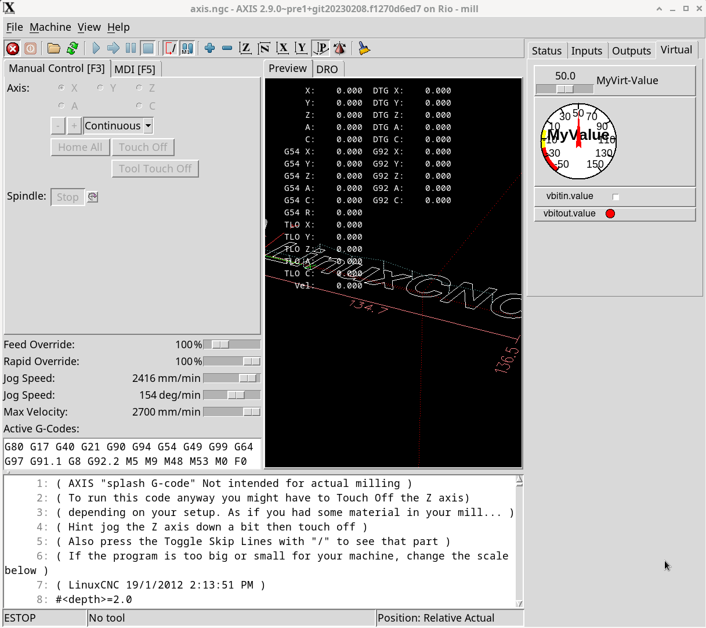

# XML-GUI

!!! only for axis at the moment !!!

## Tab-Order

if you need to reorder the tab's, you can add a list to your jcon config,

all other tab's will be append at the end

```
    "linuxcnc": {
        "machinetype": "mill",
        "pyvcp_sections": ["virtual", "status"],
...
```


## Virtual-Signals

* virtual signals are generated IO's for the XML-GUI (on the right side in axis)

* you can link this signals to all real hal-pins in linuxcnc

* this is a plugin (signal) and can be added/configure via rio-setup


Example:



```
        {
            "type": "signal",
            "name": "vvalin",
            "dir": "input",
            "signals": {
                "value": {
                    "display": {
                        "title": "MyVirt-Value",
                        "min": "-50",
                        "max": "150",
                        "initval": "50"
                    }
                }
            }
        },
        {
            "type": "signal",
            "name": "vvalout",
            "dir": "output",
            "signals": {
                "value": {
                    "net": "riov.vvalin.value",
                    "display": {
                        "title": "MyValue",
                        "type": "meter",
                        "min": "-50",
                        "max": "150",
                        "format": "0.1f",
                        "region": [
                            [
                                -50,
                                -20,
                                "red"
                            ],
                            [
                                -20,
                                0,
                                "yellow"
                            ]
                        ]
                    }
                }
            }
        },
        {
            "type": "signal",
            "name": "vbitin",
            "vtype": "bool",
            "dir": "input",
            "signals": {
                "value": {
                    "net": ""
                }
            }
        },
        {
            "type": "signal",
            "name": "vbitout",
            "vtype": "bool",
            "dir": "output",
            "signals": {
                "value": {
                    "net": "riov.vbitin.value"
                }
            }
        },
```
