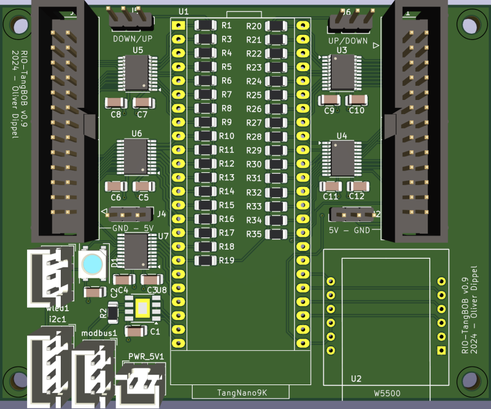
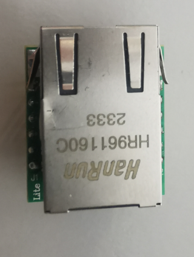
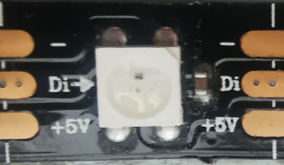
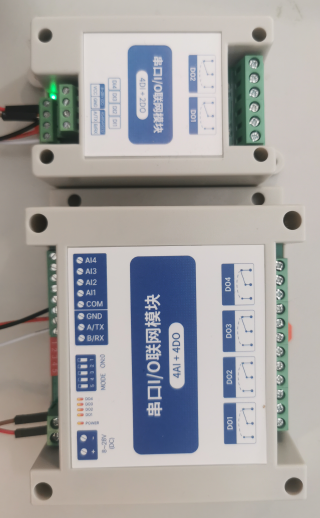
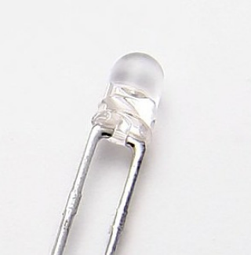
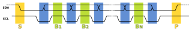
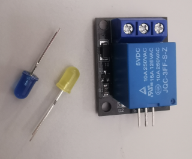
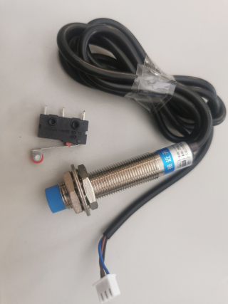
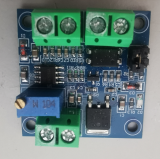
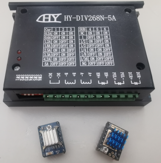

# Tangbob

Tangbob with one 5x china BOB

* Board: [Tangbob](https://github.com/multigcs/riocore/blob/main/riocore/boards/Tangbob/README.md)
* Config-Path: riocore/configs/Tangbob/config.json
* Output-Path: Output/Tangbob
* Toolchain: gowin
* Protocol: UDP

## Axis/Joints
| Axis | Joint | Plugin | Home-Seq. |
| --- | --- | --- | --- |
| X | 0 | stepdir0 ([stepdir](https://github.com/multigcs/riocore/blob/main/riocore/plugins/stepdir/README.md)) | 2 | 
| Y | 1 | stepdir1 ([stepdir](https://github.com/multigcs/riocore/blob/main/riocore/plugins/stepdir/README.md)) | 2 | 
| Z | 2 | stepdir2 ([stepdir](https://github.com/multigcs/riocore/blob/main/riocore/plugins/stepdir/README.md)) | 1 | 
| A | 3 | stepdir3 ([stepdir](https://github.com/multigcs/riocore/blob/main/riocore/plugins/stepdir/README.md)) | 2 | 

## Plugins
| Type | Info | Instance | Image |
| --- | --- | --- | --- |
| [w5500](https://github.com/multigcs/riocore/blob/main/riocore/plugins/w5500/README.md) | udp interface for host comunication | w55000 |  |
| [wled](https://github.com/multigcs/riocore/blob/main/riocore/plugins/wled/README.md) | ws2812b interface | wled0 |  |
| [modbus](https://github.com/multigcs/riocore/blob/main/riocore/plugins/modbus/README.md) | generic modbus plugin | modbus0 |  |
| [blink](https://github.com/multigcs/riocore/blob/main/riocore/plugins/blink/README.md) | blinking output pin | blink0 |  |
| [i2cbus](https://github.com/multigcs/riocore/blob/main/riocore/plugins/i2cbus/README.md) | I2C-Bus | i2cbus0 |  |
| [bitout](https://github.com/multigcs/riocore/blob/main/riocore/plugins/bitout/README.md) | singe bit output pin | bitout0, bitout1 |  |
| [bitin](https://github.com/multigcs/riocore/blob/main/riocore/plugins/bitin/README.md) | single input pin | bitin0, bitin1, bitin2, bitin3, bitin4 |  |
| [pwmout](https://github.com/multigcs/riocore/blob/main/riocore/plugins/pwmout/README.md) | pwm output | pwmout0 |  |
| [stepdir](https://github.com/multigcs/riocore/blob/main/riocore/plugins/stepdir/README.md) | step/dir output for stepper drivers | stepdir0, stepdir1, stepdir2, stepdir3 |  |

## JSON-Config
```
{
    "name": "Tangbob",
    "boardcfg": "Tangbob",
    "description": "Tangbob with one 5x china BOB",
    "protocol": "UDP",
    "plugins": [
        {
            "type": "w5500",
            "pins": {
                "mosi": {
                    "pin": "SPI:MOSI"
                },
                "miso": {
                    "pin": "SPI:MISO"
                },
                "sclk": {
                    "pin": "SPI:SCLK"
                },
                "sel": {
                    "pin": "SPI:SEL"
                }
            },
            "uid": "w55000"
        },
        {
            "type": "wled",
            "pins": {
                "data": {
                    "pin": "WLED:DATA"
                }
            },
            "signals": {
                "0_green": {
                    "net": "(!halui.mode.is-auto and !axisui.error) or halui.program.is-paused"
                },
                "0_red": {
                    "net": "axisui.error"
                },
                "0_blue": {
                    "net": "halui.mode.is-auto"
                }
            },
            "uid": "wled0"
        },
        {
            "type": "modbus",
            "pins": {
                "tx": {
                    "pin": "MODBUS:TX"
                },
                "rx": {
                    "pin": "MODBUS:RX"
                },
                "tx_enable": {
                    "pin": "MODBUS:TX_ENABLE"
                }
            },
            "config": {},
            "uid": "modbus0"
        },
        {
            "type": "blink",
            "pins": {
                "led": {
                    "pin": "10"
                }
            },
            "uid": "blink0"
        },
        {
            "type": "i2cbus",
            "pins": {
                "sda": {
                    "pin": "I2C:sda"
                },
                "scl": {
                    "pin": "I2C:scl"
                }
            },
            "uid": "i2cbus0",
            "config": {
                "devices": {
                    "lm75_0": {
                        "type": "lm75",
                        "address": "0x48",
                        "subbus": "none"
                    }
                }
            }
        }
    ],
    "modules": [
        {
            "slot": "LEFT",
            "module": "china-bob5x",
            "setup": {
                "enable": {
                    "type": "bitout",
                    "name": "enable",
                    "pins": {
                        "bit": {
                            "modifier": [
                                {
                                    "type": "invert"
                                },
                                {
                                    "type": "onerror"
                                },
                                {
                                    "type": "invert"
                                }
                            ],
                            "pin": "42"
                        }
                    },
                    "signals": {
                        "bit": {
                            "net": "halui.machine.is-on",
                            "function": "",
                            "setp": ""
                        }
                    },
                    "uid": "bitout0"
                },
                "home-x": {
                    "type": "bitin",
                    "name": "home-x",
                    "pins": {
                        "bit": {
                            "pull": "up",
                            "pin": "37"
                        }
                    },
                    "signals": {
                        "bit": {
                            "net": "joint.0.home-sw-in",
                            "function": "",
                            "setp": ""
                        }
                    },
                    "uid": "bitin0"
                },
                "home-y": {
                    "type": "bitin",
                    "name": "home-y",
                    "pins": {
                        "bit": {
                            "pull": "up",
                            "pin": "38"
                        }
                    },
                    "signals": {
                        "bit": {
                            "net": "joint.1.home-sw-in",
                            "function": "",
                            "setp": ""
                        }
                    },
                    "uid": "bitin1"
                },
                "home-z": {
                    "type": "bitin",
                    "name": "home-z",
                    "pins": {
                        "bit": {
                            "pull": "up",
                            "pin": "35"
                        }
                    },
                    "signals": {
                        "bit": {
                            "net": "joint.2.home-sw-in",
                            "function": "",
                            "setp": ""
                        }
                    },
                    "uid": "bitin2"
                },
                "spindle-enable": {
                    "type": "bitout",
                    "name": "spindle-enable",
                    "pins": {
                        "bit": {
                            "modifier": [
                                {
                                    "type": "invert"
                                }
                            ],
                            "pin": "30"
                        }
                    },
                    "signals": {
                        "bit": {
                            "net": "spindle.0.on",
                            "function": "",
                            "setp": ""
                        }
                    },
                    "uid": "bitout1"
                },
                "pwm": {
                    "type": "pwmout",
                    "name": "pwm",
                    "pins": {
                        "pwm": {
                            "modifier": [
                                {
                                    "type": "invert"
                                }
                            ],
                            "pin": "53"
                        }
                    },
                    "uid": "pwmout0"
                },
                "e-stop": {
                    "type": "bitin",
                    "name": "e-stop",
                    "pins": {
                        "bit": {
                            "pull": "up",
                            "pin": "39"
                        }
                    },
                    "uid": "bitin3"
                },
                "probe": {
                    "type": "bitin",
                    "name": "probe",
                    "pins": {
                        "bit": {
                            "pull": "up",
                            "pin": "36"
                        }
                    },
                    "uid": "bitin4"
                },
                "joint-0": {
                    "name": "joint-0",
                    "type": "stepdir",
                    "is_joint": true,
                    "uid": "stepdir0",
                    "pins": {
                        "step": {
                            "pin": "41"
                        },
                        "dir": {
                            "pin": "40"
                        }
                    }
                },
                "joint-1": {
                    "name": "joint-1",
                    "type": "stepdir",
                    "is_joint": true,
                    "uid": "stepdir1",
                    "pins": {
                        "step": {
                            "pin": "33"
                        },
                        "dir": {
                            "pin": "29"
                        }
                    }
                },
                "joint-2": {
                    "name": "joint-2",
                    "type": "stepdir",
                    "is_joint": true,
                    "uid": "stepdir2",
                    "pins": {
                        "step": {
                            "pin": "28"
                        },
                        "dir": {
                            "pin": "27"
                        }
                    }
                },
                "joint-3": {
                    "name": "joint-3",
                    "type": "stepdir",
                    "is_joint": true,
                    "uid": "stepdir3",
                    "pins": {
                        "step": {
                            "pin": "26"
                        },
                        "dir": {
                            "pin": "25"
                        }
                    }
                }
            }
        }
    ],
    "url": "https://wiki.sipeed.com/hardware/en/tang/Tang-Nano-9K/Nano-9K.html",
    "board": "TangNano9K",
    "type": "GW1NR-LV9QN88PC6/I5",
    "family": "GW1N-9C",
    "toolchains": [
        "gowin",
        "icestorm"
    ],
    "toolchain": "gowin",
    "package": "",
    "clock": {
        "speed": "27000000",
        "_osc": "27000000",
        "_speed": "32400000",
        "pin": "52"
    },
    "slots": [
        {
            "name": "LED",
            "comment": "LED",
            "pins": {
                "L1": {
                    "pin": "10",
                    "rotate": true,
                    "pos": [
                        430,
                        108
                    ],
                    "direction": "output"
                },
                "L2": {
                    "pin": "11",
                    "rotate": true,
                    "pos": [
                        415,
                        108
                    ],
                    "direction": "output"
                },
                "L3": {
                    "pin": "13",
                    "rotate": true,
                    "pos": [
                        400,
                        108
                    ],
                    "direction": "output"
                },
                "L4": {
                    "pin": "14",
                    "rotate": true,
                    "pos": [
                        385,
                        108
                    ],
                    "direction": "output"
                },
                "L5": {
                    "pin": "15",
                    "rotate": true,
                    "pos": [
                        370,
                        108
                    ],
                    "direction": "output"
                },
                "L6": {
                    "pin": "16",
                    "rotate": true,
                    "pos": [
                        355,
                        108
                    ],
                    "direction": "output"
                }
            }
        },
        {
            "name": "UART",
            "comment": "USB-UART",
            "default": "",
            "pins": {
                "RX": {
                    "pin": "18",
                    "pos": [
                        370,
                        38
                    ],
                    "direction": "input"
                },
                "TX": {
                    "pin": "17",
                    "pos": [
                        390,
                        38
                    ],
                    "direction": "output"
                }
            }
        },
        {
            "name": "WLED",
            "compatible": [
                "wled",
                "wled_bar",
                "wled_expansion"
            ],
            "pos": [
                79,
                446
            ],
            "pins": {
                "DATA": {
                    "pin": "54",
                    "direction": "output"
                }
            }
        },
        {
            "name": "MODBUS",
            "compatible": [
                "modbus",
                "uartbridge"
            ],
            "pos": [
                150,
                603
            ],
            "pins": {
                "RX": {
                    "pin": "69",
                    "direction": "input"
                },
                "TX": {
                    "pin": "57",
                    "direction": "output"
                },
                "TX_ENABLE": {
                    "pin": "68",
                    "direction": "output"
                }
            }
        },
        {
            "name": "I2C",
            "comment": "5V I2C port",
            "pins": {
                "sda": {
                    "pin": "56",
                    "pos": [
                        79,
                        603
                    ],
                    "direction": "all"
                },
                "scl": {
                    "pin": "55",
                    "pos": [
                        79,
                        582
                    ],
                    "direction": "output"
                }
            }
        },
        {
            "name": "SPI",
            "comment": "spi port of the w5500 header",
            "default": "w5500",
            "pins": {
                "MOSI": {
                    "pin": "32",
                    "pos": [
                        716,
                        515
                    ],
                    "direction": "all"
                },
                "SCLK": {
                    "pin": "31",
                    "pos": [
                        716,
                        494
                    ],
                    "direction": "all"
                },
                "SEL": {
                    "pin": "49",
                    "pos": [
                        716,
                        476
                    ],
                    "direction": "all"
                },
                "MISO": {
                    "pin": "48",
                    "pos": [
                        537,
                        452
                    ],
                    "direction": "all"
                }
            }
        },
        {
            "name": "RIGHT",
            "comment": "right bob adapter",
            "default_module": "china-bob5x",
            "rect": [
                640,
                20,
                70,
                360
            ],
            "pins": {
                "P1": {
                    "pin": "63",
                    "pos": [
                        650,
                        50
                    ],
                    "direction": "all"
                },
                "P2": {
                    "pin": "85",
                    "pos": [
                        650,
                        74
                    ],
                    "direction": "all"
                },
                "P3": {
                    "pin": "83",
                    "pos": [
                        650,
                        98
                    ],
                    "direction": "all"
                },
                "P4": {
                    "pin": "81",
                    "pos": [
                        650,
                        122
                    ],
                    "direction": "all"
                },
                "P5": {
                    "pin": "79",
                    "pos": [
                        650,
                        146
                    ],
                    "direction": "all"
                },
                "P6": {
                    "pin": "77",
                    "pos": [
                        650,
                        170
                    ],
                    "direction": "all"
                },
                "P7": {
                    "pin": "76",
                    "pos": [
                        650,
                        194
                    ],
                    "direction": "all"
                },
                "P8": {
                    "pin": "75",
                    "pos": [
                        650,
                        218
                    ],
                    "direction": "all"
                },
                "P9": {
                    "pin": "74",
                    "pos": [
                        650,
                        242
                    ],
                    "direction": "all"
                },
                "P10": {
                    "pin": "73",
                    "pos": [
                        650,
                        266
                    ],
                    "direction": "all"
                },
                "P11": {
                    "pin": "72",
                    "pos": [
                        650,
                        290
                    ],
                    "direction": "all"
                },
                "P12": {
                    "pin": "71",
                    "pos": [
                        650,
                        314
                    ],
                    "direction": "all"
                },
                "P13": {
                    "pin": "51",
                    "pos": [
                        650,
                        338
                    ],
                    "direction": "all"
                },
                "P14": {
                    "pin": "86",
                    "pos": [
                        674,
                        50
                    ],
                    "direction": "all"
                },
                "P15": {
                    "pin": "84",
                    "pos": [
                        674,
                        74
                    ],
                    "direction": "all"
                },
                "P16": {
                    "pin": "82",
                    "pos": [
                        674,
                        98
                    ],
                    "direction": "all"
                },
                "P17": {
                    "pin": "80",
                    "pos": [
                        674,
                        122
                    ],
                    "direction": "all"
                }
            }
        },
        {
            "name": "LEFT",
            "comment": "left  bob adapter",
            "default_module": "china-bob5x",
            "rect": [
                75,
                20,
                70,
                360
            ],
            "pins": {
                "P1": {
                    "pin": "53",
                    "pos": [
                        109,
                        338
                    ],
                    "direction": "all"
                },
                "P2": {
                    "pin": "41",
                    "pos": [
                        109,
                        314
                    ],
                    "direction": "all"
                },
                "P3": {
                    "pin": "40",
                    "pos": [
                        109,
                        290
                    ],
                    "direction": "all"
                },
                "P4": {
                    "pin": "33",
                    "pos": [
                        109,
                        266
                    ],
                    "direction": "all"
                },
                "P5": {
                    "pin": "29",
                    "pos": [
                        109,
                        242
                    ],
                    "direction": "all"
                },
                "P6": {
                    "pin": "28",
                    "pos": [
                        109,
                        218
                    ],
                    "direction": "all"
                },
                "P7": {
                    "pin": "27",
                    "pos": [
                        109,
                        194
                    ],
                    "direction": "all"
                },
                "P8": {
                    "pin": "26",
                    "pos": [
                        109,
                        170
                    ],
                    "direction": "all"
                },
                "P9": {
                    "pin": "25",
                    "pos": [
                        109,
                        146
                    ],
                    "direction": "all"
                },
                "P10": {
                    "pin": "39",
                    "pos": [
                        109,
                        122
                    ],
                    "direction": "all"
                },
                "P11": {
                    "pin": "36",
                    "pos": [
                        109,
                        98
                    ],
                    "direction": "all"
                },
                "P12": {
                    "pin": "37",
                    "pos": [
                        109,
                        74
                    ],
                    "direction": "all"
                },
                "P13": {
                    "pin": "38",
                    "pos": [
                        109,
                        50
                    ],
                    "direction": "all"
                },
                "P14": {
                    "pin": "42",
                    "pos": [
                        85,
                        338
                    ],
                    "direction": "all"
                },
                "P15": {
                    "pin": "35",
                    "pos": [
                        85,
                        314
                    ],
                    "direction": "all"
                },
                "P16": {
                    "pin": "34",
                    "pos": [
                        85,
                        290
                    ],
                    "direction": "all"
                },
                "P17": {
                    "pin": "30",
                    "pos": [
                        85,
                        266
                    ],
                    "direction": "all"
                }
            }
        }
    ]
}
```
