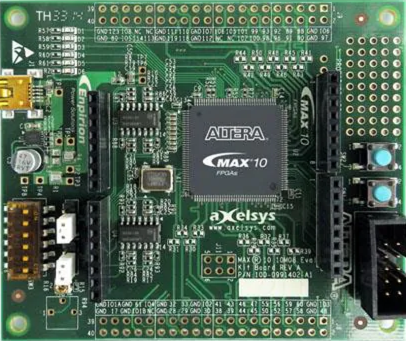

# Altera10M08Eval
**Altera10M08Eval - Evaluation Kit**

* URL: [https://www.intel.com/content/www/us/en/products/details/fpga/development-kits/max/10m08-evaluation-kit.html](https://www.intel.com/content/www/us/en/products/details/fpga/development-kits/max/10m08-evaluation-kit.html)
* Toolchain: quartus
* Family: MAX 10
* Type: 10M08SAE144C8G
* Package: E144
* Clock: 50.000Mhz (Pin:PIN_27)

