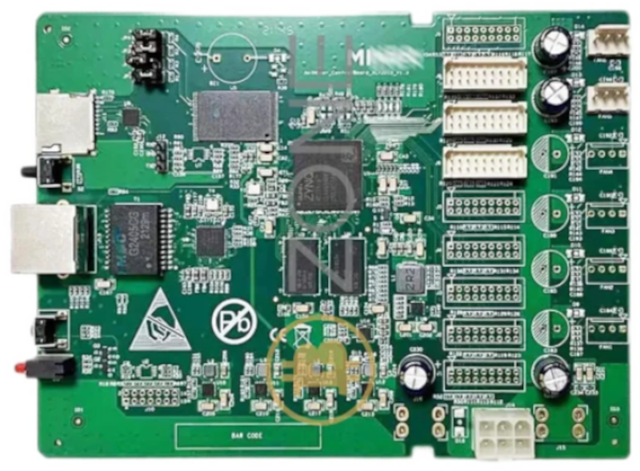

# AntminerS9
**AntminerS9 - WIP**

* URL: [https://github.com/astranome/Astra_S9_FPGA](https://github.com/astranome/Astra_S9_FPGA)
* Toolchain: [vivado](../../generator/toolchains/vivado/README.md)
* Family: XC7
* Type: xc7z010clg400-1
* Package: csg324
* Clock: 150.000Mhz (Pin:None)
* Example-Configs: [AntminerS9](../../configs/AntminerS9)

