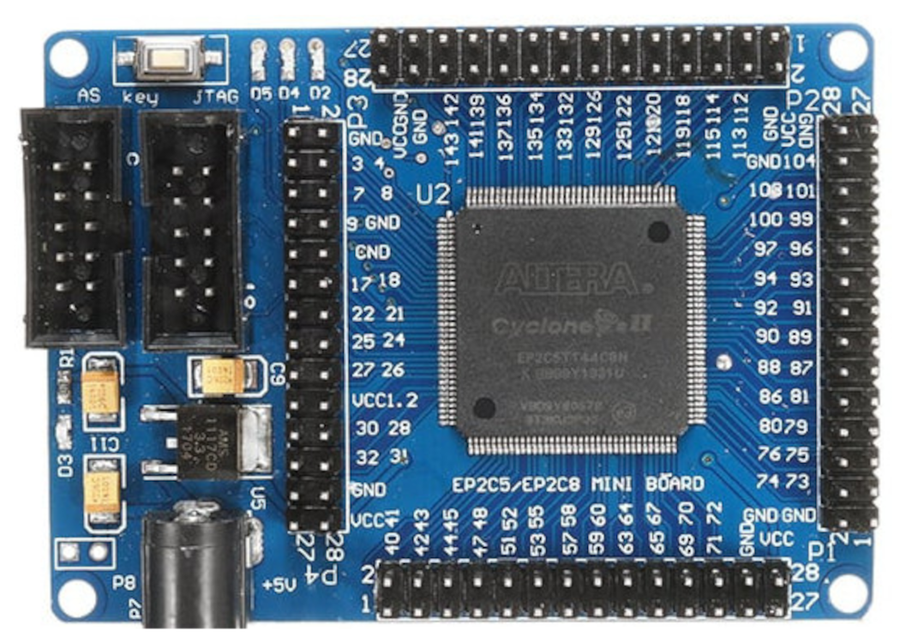

# EP2C5T144
**EP2C5T144 dev-board - untested - for this board, you need an older quartus toolchain (quartus-ii-web-edition 13-0sp1)**

* URL: 
* Toolchain: quartus
* Family: Cyclone II
* Type: EP2C5T144C8
* Package: TQFP144
* Clock: 50.000Mhz (Pin:PIN_17)

