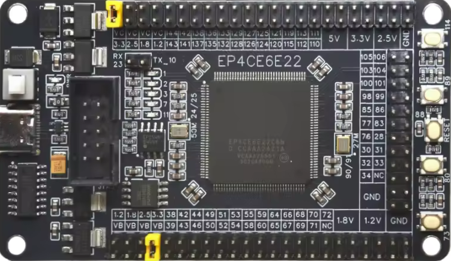

# EP4CE6E22C8
**EP4CE6E22C8 devboard**

* URL: 
* Toolchain: [quartus](../../generator/toolchains/quartus/README.md)
* Family: Cyclone IV E
* Type: EP4CE6E22C8
* Package: 
* Clock: 50.000Mhz (Pin:PIN_24)
* Example-Configs: [EP4CE6E22C8](../../configs/EP4CE6E22C8)

