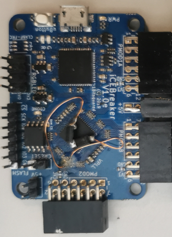

# ICEBreakerV1.0e
**Small and low cost FPGA educational and development board**

* URL: [https://github.com/icebreaker-fpga/icebreaker](https://github.com/icebreaker-fpga/icebreaker)
* Toolchain: [icestorm](../../generator/toolchains/icestorm/README.md)
* Family: ice40
* Type: up5k
* Package: sg48
* Flashcmd: openFPGALoader -b ice40_generic rio.bin -f
* Clock: 12.000Mhz -> PLL -> 30.000Mhz (Pin:35)
* Example-Configs: [ICEBreakerV1.0e](../../configs/ICEBreakerV1.0e)

