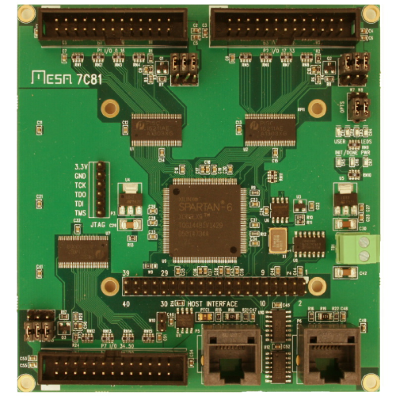

# Mesa7c81
**Mesa7c81 over SPI - WIP**

* URL: [https://eusurplus.com/index.php?route=product/product&product_id=131](https://eusurplus.com/index.php?route=product/product&product_id=131)
* Toolchain: [ise](../../generator/toolchains/ise/README.md)
* Family: xc6
* Type: xc6slx9-2tqg144
* Package: tqg144
* Flashcmd: openFPGALoader -v -c usb-blaster --fpga-part xc6slx9tqg144 -f rio.bit
* Clock: 50.000Mhz (Pin:p50)
* Example-Configs: [Mesa7c81](../../configs/Mesa7c81)

