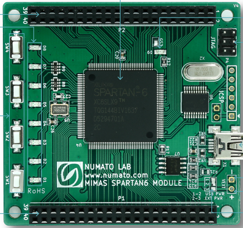

# Numato-Spartan6
**Spartan6 - only for testing the toolchain**

* URL: [https://numato.com/product/mimas-spartan-6-fpga-development-board/](https://numato.com/product/mimas-spartan-6-fpga-development-board/)
* Toolchain: ise
* Family: xc6
* Type: xc6slx9-2tqg144
* Package: tqg144
* Flashcmd: openFPGALoader -v -c usb-blaster --fpga-part xc6slx9tqg144 -f rio.bit
* Clock: 50.000Mhz (Pin:p126)

