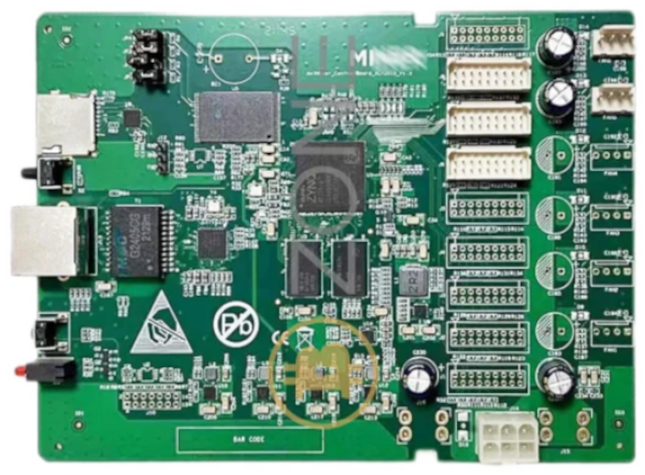

# BOARDS
| Name | Info | FPGA | Toolchains | Image |
| --- | --- | --- |  --- | :---: |
| [Altera10M08Eval](Altera10M08Eval/README.md) | Altera10M08Eval - Evaluation Kit | MAX 10 / 10M08SAE144C8G | [quartus](../generator/toolchains/quartus/README.md) |  |
| [AntminerS9](AntminerS9/README.md) | AntminerS9 - WIP | XC7 / xc7z010clg400-1 | [vivado](../generator/toolchains/vivado/README.md) |  |
| [Arty-a7-35t](Arty-a7-35t/README.md) | Digilent - Arty a7-35t | xc7 / xc7a35ticsg324-1l | [vivado](../generator/toolchains/vivado/README.md) |  |
| [Basys2](Basys2/README.md) | Digilent - Basys2 | xc3 / xc3s100e-4-cp132 | [ise](../generator/toolchains/ise/README.md) |  |
| [CYC1000](CYC1000/README.md) | TEI0003 | Cyclone 10 LP / 10CL025YU256C8G | [quartus](../generator/toolchains/quartus/README.md) |  |
| [Colorlight5A-75B-v8.0](Colorlight5A-75B-v8.0/README.md) | Lattice ECP5 board | ecp5 / 25k | [icestorm](../generator/toolchains/icestorm/README.md) |  |
| [Colorlight5A-75E](Colorlight5A-75E/README.md) | Lattice ECP5 board | ecp5 / 25k | [icestorm](../generator/toolchains/icestorm/README.md) |  |
| [Colorlight_i5-v7_0](Colorlight_i5-v7_0/README.md) | Lattice ECP5 on SODIMM-200P board | ecp5 / 25k | [icestorm](../generator/toolchains/icestorm/README.md) |  |
| [Colorlight_i9plus-v6.1](Colorlight_i9plus-v6.1/README.md) | Artix7 on SODIMM-200P board | xc7 / xc7a50tifgg484-1l | [vivado](../generator/toolchains/vivado/README.md) |  |
| [EBAZ4205](EBAZ4205/README.md) | EBAZ4205 - WIP | XC7 / xc7z010clg400-1 | [vivado](../generator/toolchains/vivado/README.md) |  |
| [EP2C5T144](EP2C5T144/README.md) | EP2C5T144 dev-board - untested - for this board, you need an older quartus toolchain (quartus-ii-web-edition 13-0sp1) | Cyclone II / EP2C5T144C8 | [quartus](../generator/toolchains/quartus/README.md) |  |
| [FireAnt](FireAnt/README.md) | Efinix FireAnt - only for toolchain testing | Trion / T8F81 | [efinity](../generator/toolchains/efinity/README.md) | |
| [ICEBreakerV1.0e](ICEBreakerV1.0e/README.md) | Small and low cost FPGA educational and development board | ice40 / up5k | [icestorm](../generator/toolchains/icestorm/README.md) |  |
| [IceShield](IceShield/README.md) | RIO-IceShield board for Raspberry PI4 | ice40 / up5k | [icestorm](../generator/toolchains/icestorm/README.md) |  |
| [LX9MicroBoard](LX9MicroBoard/README.md) | LX9MicroBoard - Spartan6 devboard
on my debian12, it works with openFPGAloader | xc6 / xc6slx9-csg324 | [ise](../generator/toolchains/ise/README.md) |  |
| [Mesa7c81](Mesa7c81/README.md) | Mesa7c81 over SPI - WIP | xc6 / xc6slx9-2tqg144 | [ise](../generator/toolchains/ise/README.md) |  |
| [MotoMan](MotoMan/README.md) | RIO-MotoMan board | ice40 / hx8k | [icestorm](../generator/toolchains/icestorm/README.md) |  |
| [Numato-Spartan6](Numato-Spartan6/README.md) | Spartan6 - only for testing the toolchain | xc6 / xc6slx9-2tqg144 | [ise](../generator/toolchains/ise/README.md) |  |
| [OctoBot](OctoBot/README.md) | RIO-OctoBot board | ice40 / hx8k | [icestorm](../generator/toolchains/icestorm/README.md) |  |
| [Olimex-ICE40HX8K-EVB](Olimex-ICE40HX8K-EVB/README.md) | ICE40HX8K FPGA development board | ice40 / hx8k | [icestorm](../generator/toolchains/icestorm/README.md) |  |
| [Spartan6](Spartan6/README.md) | Spartan6 - only for testing the toolchain | xc6 / xc6slx9-2tqg144 | [ise](../generator/toolchains/ise/README.md) | |
| [TangNano20K](TangNano20K/README.md) | TangNano20K - GW2AR-18 devboard | GW2AR-18C / GW2AR-LV18QN88C8/I7 | [gowin](../generator/toolchains/gowin/README.md), [icestorm](../generator/toolchains/icestorm/README.md) |  |
| [TangNano9K](TangNano9K/README.md) | TangNano9K - cheap GW1NR-9 Devboard | GW1N-9C / GW1NR-LV9QN88PC6/I5 | [gowin](../generator/toolchains/gowin/README.md), [icestorm](../generator/toolchains/icestorm/README.md) |  |
| [TangPrimer20K](TangPrimer20K/README.md) | TangPrimer20K-Devboard on Dock ext-board | GW2A-18C / GW2A-LV18PG256C8/I7 | [gowin](../generator/toolchains/gowin/README.md), [icestorm](../generator/toolchains/icestorm/README.md) |  |
| [TangPrimer25K](TangPrimer25K/README.md) | TangPrimer25K-Devboard on Dev-Board | GW5A-25A / GW5A-LV25MG121NC1/I0 | [gowin](../generator/toolchains/gowin/README.md), [icestorm](../generator/toolchains/icestorm/README.md) |  |
| [Tangbob](Tangbob/README.md) | TangNano9K - cheap GW1NR-9 Devboard | GW1N-9C / GW1NR-LV9QN88PC6/I5 | [gowin](../generator/toolchains/gowin/README.md), [icestorm](../generator/toolchains/icestorm/README.md) |  |
| [Tangoboard](Tangoboard/README.md) | based on TangNano9k | GW1N-9C / GW1NR-LV9QN88PC6/I5 | [gowin](../generator/toolchains/gowin/README.md), [icestorm](../generator/toolchains/icestorm/README.md) |  |
| [iceWerx-iCE40-HX8K](iceWerx-iCE40-HX8K/README.md) | Devantech iceWerx iCE40-HX8K FPGA | ice40 / hx8k | [icestorm](../generator/toolchains/icestorm/README.md) |  |
| [rioctrl](rioctrl/README.md) | rioctrl- a modular hardware for riocore | ecp5 / 25k | [icestorm](../generator/toolchains/icestorm/README.md) |  |
