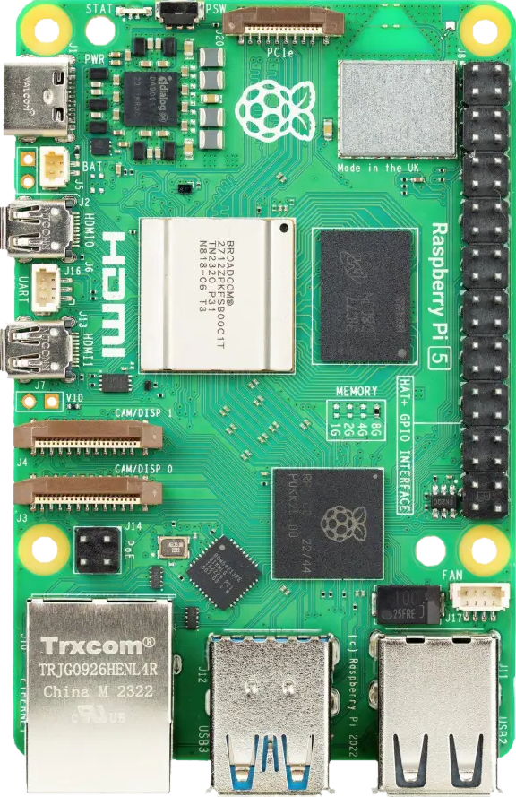

# EP4CE6E22C8
**EP4CE6E22C8 devboard**

cheap devboard from china but low LE count and can not write to flash via openFPGALoader

* URL: [https://de.aliexpress.com/item/1005009306876743.html](https://de.aliexpress.com/item/1005009306876743.html)
* Toolchain: [quartus](../../generator/toolchains/quartus/README.md)
* Family: Cyclone IV E
* Type: EP4CE6E22C8
* Package: 
* Clock: 50.000Mhz -> PLL -> 100.000Mhz (Pin:PIN_24)
* Example-Configs: [EP4CE6E22C8](../../configs/EP4CE6E22C8)

