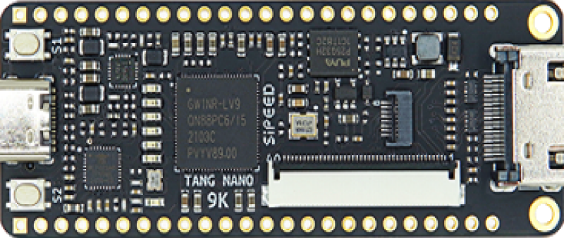

# TangNano9K
**TangNano9K - cheap GW1NR-9 Devboard**

* URL: [https://wiki.sipeed.com/hardware/en/tang/Tang-Nano-9K/Nano-9K.html](https://wiki.sipeed.com/hardware/en/tang/Tang-Nano-9K/Nano-9K.html)
* Toolchain: gowin (gowin, icestorm)
* Family: GW1N-9C
* Type: GW1NR-LV9QN88PC6/I5
* Package: 
* Clock: 27.000Mhz (Pin:52)

