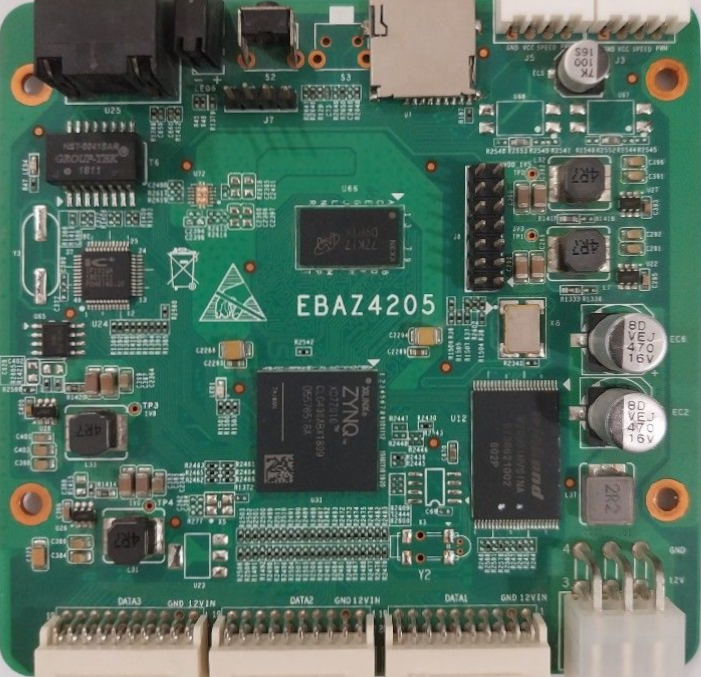

# XC7Z010
**XC7Z010-1CLG400I template - no PS - no Ethernet support**

* URL: 
* Toolchain: [vivado](../../generator/toolchains/vivado/README.md)
* Family: XC7
* Type: xc7z010clg400-1
* Package: csg324
* Clock: 25.000Mhz (Pin:U18)
* Example-Configs: [XC7Z010](../../configs/XC7Z010)

