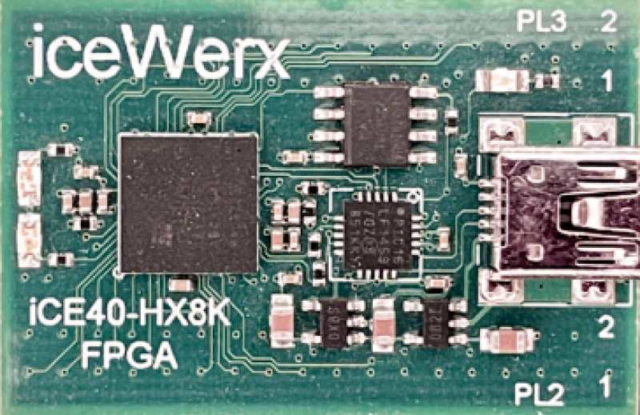

# iceWerx-iCE40-HX8K
**Devantech iceWerx iCE40-HX8K FPGA**

* URL: [https://eu.robotshop.com/de/products/devantech-icewerx-ice40-hx8k-fpga](https://eu.robotshop.com/de/products/devantech-icewerx-ice40-hx8k-fpga)
* Toolchain: icestorm
* Family: ice40
* Type: hx8k
* Package: cb132
* Flashcmd: iceFUNprog rio.bin
* Clock: 12.000Mhz -> PLL -> 60.000Mhz (Pin:P7)

