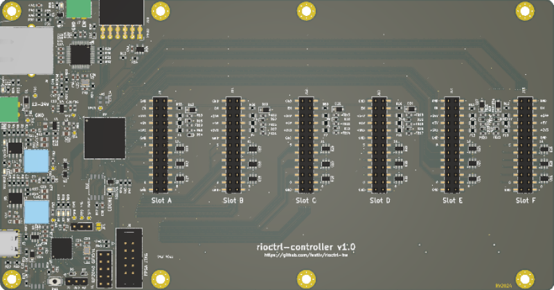

# rioctrl
**rioctrl- a modular hardware for riocore**

* URL: [https://github.com/festlv/rioctrl-hw](https://github.com/festlv/rioctrl-hw)
* Toolchain: icestorm
* Family: ecp5
* Type: 25k
* Package: CABGA256
* Clock: 25.000Mhz -> PLL -> 100.000Mhz (Pin:A7)

