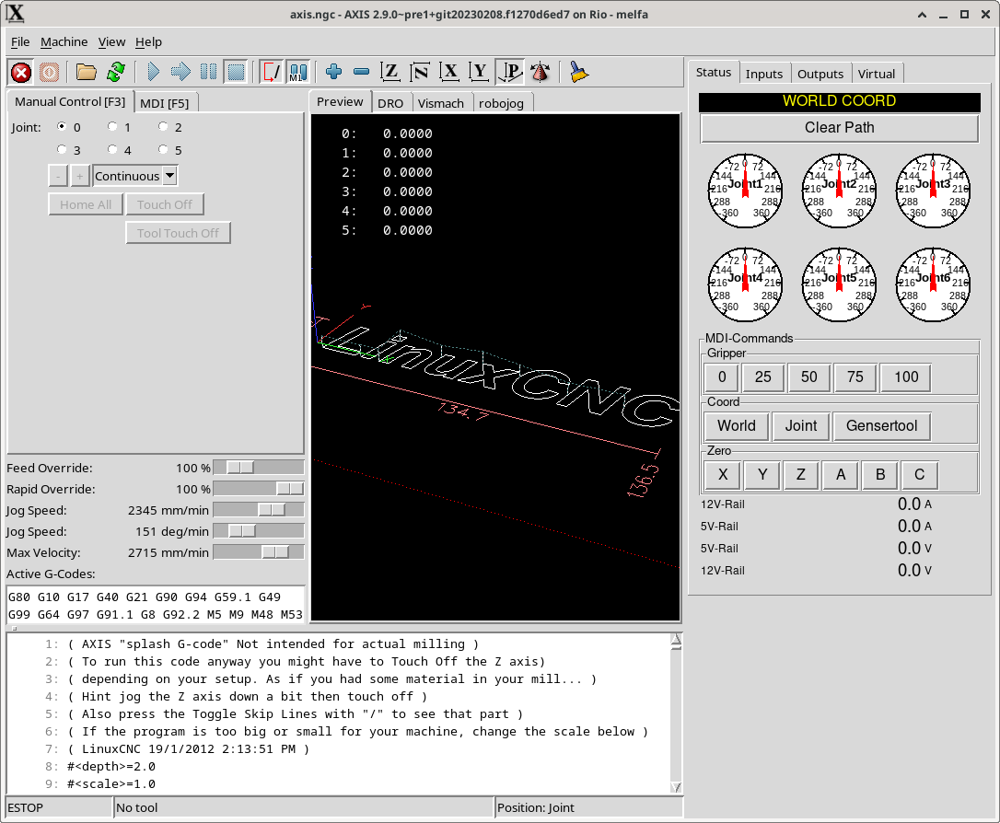
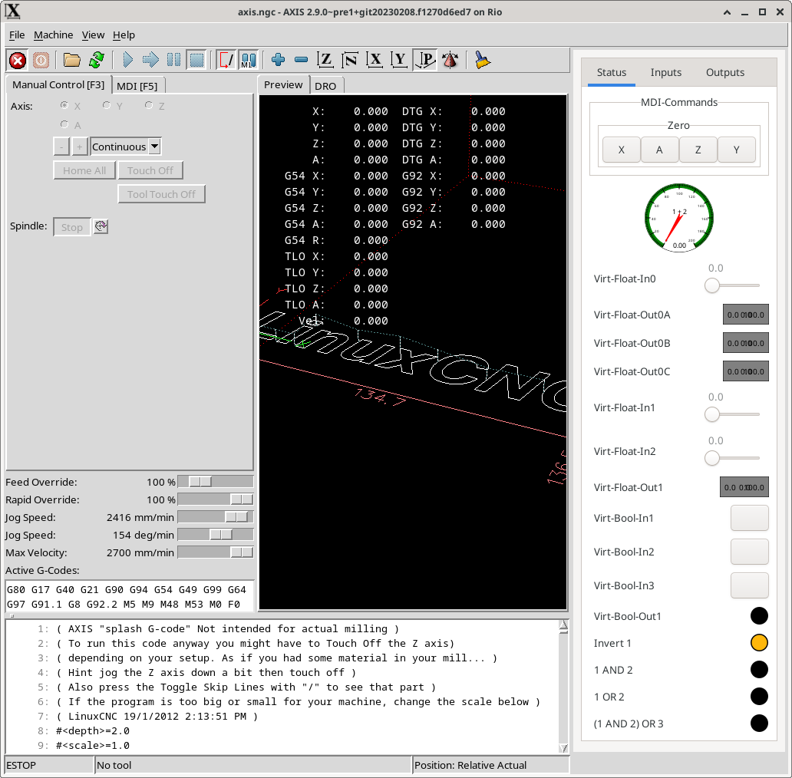
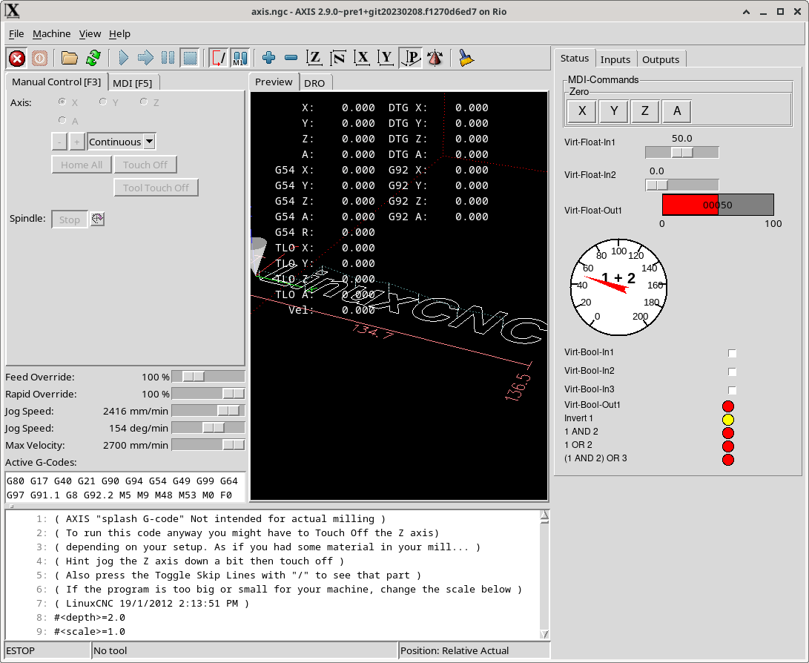
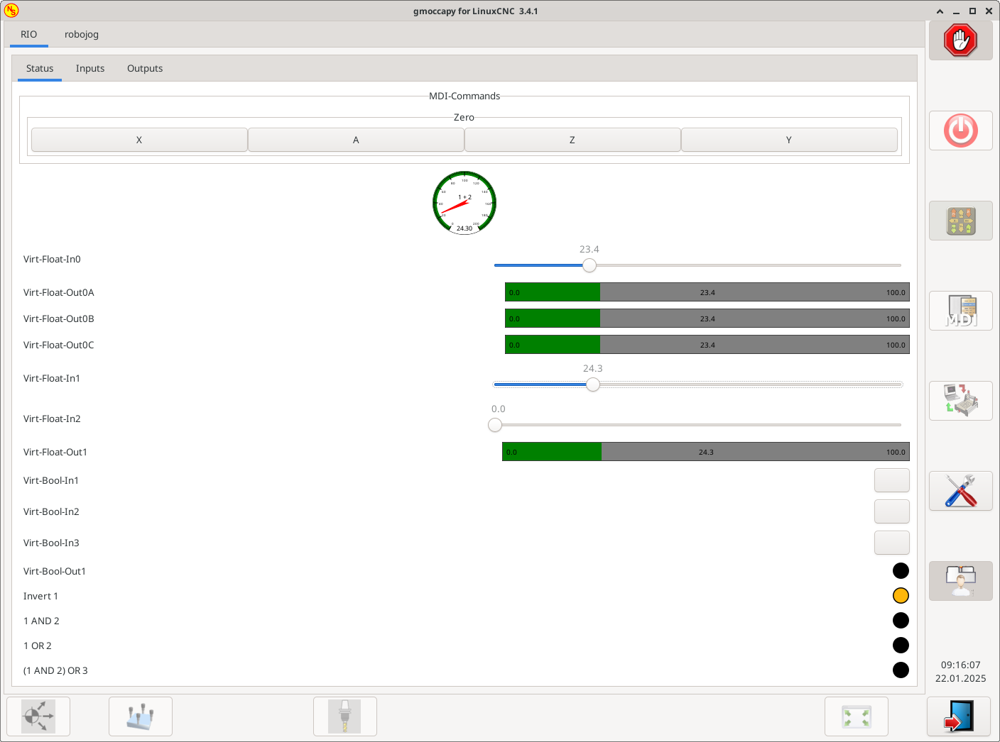
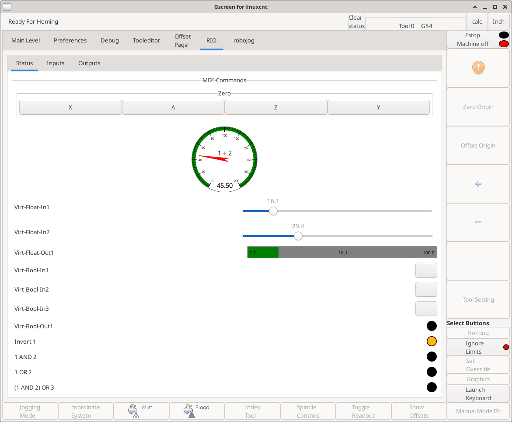
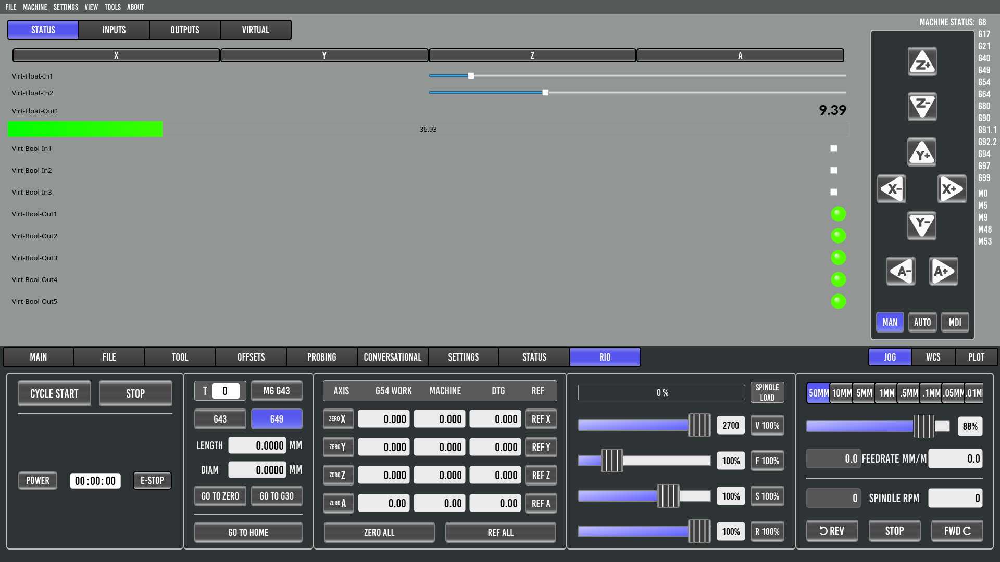
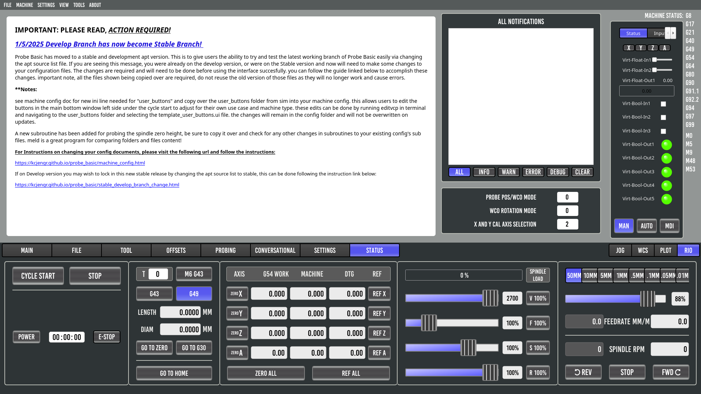
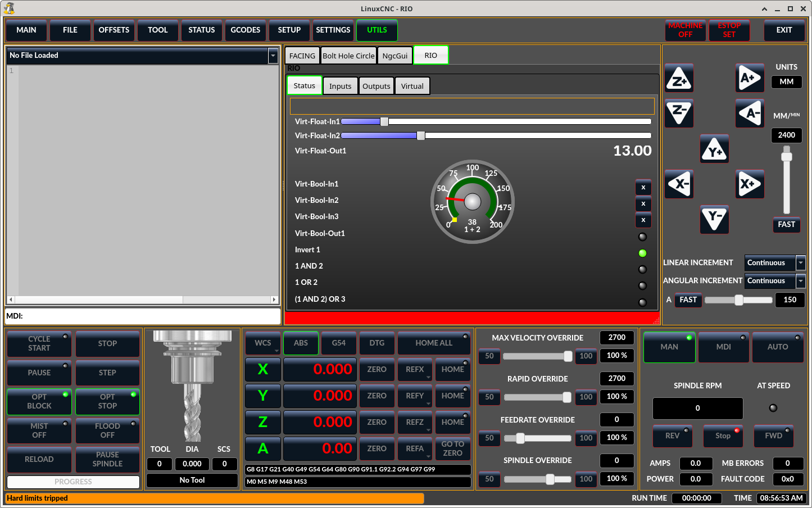

# some demo configs

to show the different generated vcp gui's

## axis-gladevcp-robot

## axis-gladevcp

## axis-pyvcp

## gmoccapy-gladevcp

## gscreen-gladevcp

## probebasic-qtpyvcp 

## probebasic-qtpyvcp-right 

## qtdragon-qtvcp

