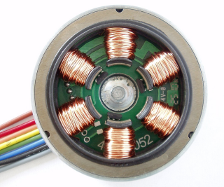
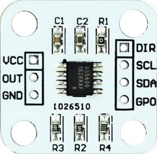
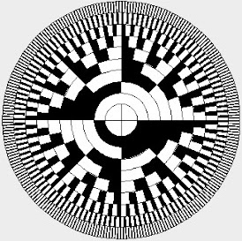

# PLUGINS

| Type | Name | Info | Image | Experimental |
| --- | :---: | --- | :---: | :---: |
| Interfaces | [arty_mii](arty_mii/README.md) | udp interface for host comunication - Arty7-35t only |  | X |
|  | [rmii](rmii/README.md) | rmii udp interface |  | X |
|  | [spi](spi/README.md) | spi interface for host comunication |  |  |
|  | [uart](uart/README.md) | uart interface for host cominucation |  |  |
|  | [w5500](w5500/README.md) | udp interface for host comunication |  |  |
| Joints | [bldc](bldc/README.md) | BLDC FOC |  | X |
|  | [hbridge](hbridge/README.md) | hbridge output |  |  |
|  | [pdmout](pdmout/README.md) | pdm output |  |  |
|  | [pwmout](pwmout/README.md) | pwm output |  |  |
|  | [rcservo](rcservo/README.md) | rc-servo output |  |  |
|  | [riodrive](riodrive/README.md) | to control a riodrive via can-bus |  | X |
|  | [stepdir](stepdir/README.md) | step/dir output for stepper drivers |  |  |
|  | [stepper](stepper/README.md) | stepper driver output for H-Bridges like L298 |  |  |
| IO | [as5600pwm](as5600pwm/README.md) | as5600 pwm input |  |  |
|  | [binin](binin/README.md) | binary to decimal input |  |  |
|  | [binout](binout/README.md) | decimal to binary output |  |  |
|  | [bitcopy](bitcopy/README.md) | copy a bit/pin to an other output pin |  |  |
|  | [bitin](bitin/README.md) | single input pin |  |  |
|  | [bitout](bitout/README.md) | singe bit output pin |  |  |
|  | [blink](blink/README.md) | blinking output pin |  |  |
|  | [caliper](caliper/README.md) | reading position from cheap calipers |  |  |
|  | [counter](counter/README.md) | pulse counter input |  |  |
|  | [demux](demux/README.md) | binary demultiplexer |  |  |
|  | [dis7seg](dis7seg/README.md) | 7segment display with buttons |  |  |
|  | [ds18b20](ds18b20/README.md) | 1Wire Temperature sensor |  |  |
|  | [flipflop_in](flipflop_in/README.md) | flipflop input |  |  |
|  | [flipflop_out](flipflop_out/README.md) | flipflop output |  |  |
|  | [freqin](freqin/README.md) | frequency input |  |  |
|  | [freqout](freqout/README.md) | frequency output |  |  |
|  | [hallsensor](hallsensor/README.md) | bldc hallsensor |  |  |
|  | [hx710](hx710/README.md) | 24bit adc |  |  |
|  | [hx711](hx711/README.md) | digital weight sensor |  |  |
|  | [i2cbus](i2cbus/README.md) | I2C-Bus |  |  |
|  | [icewerxadc](icewerxadc/README.md) | 4-channel adc of the iceWerx-board |  |  |
|  | [irin](irin/README.md) | IR-Remote input |  |  |
|  | [max10adc](max10adc/README.md) | MAX10 ADC inputs |  |  |
|  | [max6675](max6675/README.md) | SPI temperature sensor |  |  |
|  | [max7219](max7219/README.md) | 7segment display based on max7219 |  |  |
|  | [mux](mux/README.md) | binary multiplexer |  |  |
|  | [panasonic_abs](panasonic_abs/README.md) | serial abs-encoder |  | X |
|  | [pinroute](pinroute/README.md) | routing one output pin to multiple inputs |  |  |
|  | [pwmin](pwmin/README.md) | pwm input |  |  |
|  | [quadencoder](quadencoder/README.md) | quadencoder |  |  |
|  | [quadencoderz](quadencoderz/README.md) | quadencoder with index pin |  |  |
|  | [rioencoder](rioencoder/README.md) | serial abs-encoder |  | X |
|  | [signal](signal/README.md) | virtual signal |  |  |
|  | [sinepwm](sinepwm/README.md) | sine pwm output |  |  |
|  | [sonar](sonar/README.md) | sonar sensor for distance measurement |  |  |
|  | [spipoti](spipoti/README.md) | spi digital poti |  |  |
|  | [tlc549c](tlc549c/README.md) | spi adc input |  |  |
|  | [tm1638b8s7l8](tm1638b8s7l8/README.md) | 7segment display with buttons |  |  |
|  | [udpoti](udpoti/README.md) | digital-poti with up/down+dir interface |  |  |
|  | [wled](wled/README.md) | ws2812b interface |  |  |
|  | [wled_bar](wled_bar/README.md) | ws2812b interface for bar-displays |  |  |
|  | [yaskawa_abs](yaskawa_abs/README.md) | serial abs-encoder |  | X |
| FrameIO | [modbus](modbus/README.md) | generic modbus plugin |  |  |
|  | [uartbridge](uartbridge/README.md) | uart bridge - python only |  | X |
| Expansions | [shiftreg](shiftreg/README.md) | Expansion to add I/O's via shiftregister's |  |  |
|  | [wled](wled/README.md) | ws2812b interface acting as an expansion port |  |  |
