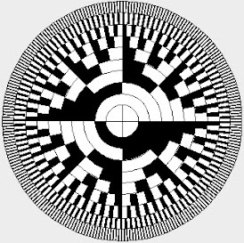

# abs_encoder

| :warning: EXPERIMENTAL |
|:-----------------------|

**serial abs-encoder**

abs-encoder over rs485

angle scale: 16bit (65536)
position scale: 17bit (131072)

protocol in short:
    * RS485
    * manchester code
    * stuffing bit (after 5x1)
    * 16bit checksum

very time critical
on TangNano9k:
 "speed": "32400000",
 parameter DELAY=3, parameter DELAY_NEXT=4

* Keywords: absolute angle encoder
* NEEDS: fpga

## Node-Types
| Name | Image |
| --- | --- |
| panasonic | - |
| stepperonline | - |
| t3d | - |
| yaskawa | - |
| rioencoder | - |

## Pins:
*FPGA-pins*
### rx:

 * direction: input

### tx:

 * direction: output

### tx_enable:

 * direction: output

### debug_bit:

 * direction: output
 * optional: True

### rx_synced:

 * direction: output
 * optional: True

## Options:
*user-options*
### name:
name of this plugin instance

 * type: str
 * default: 

### node_type:
encoder type

 * type: select
 * default: yaskawa
 * options: panasonic, stepperonline, t3d, yaskawa, rioencoder

### delay:
clock delay for next manchester bit

 * type: int
 * min: 1
 * max: 100
 * default: 3
 * unit: clocks

### delay_next:
clock delay for center of the next manchester bit

 * type: int
 * min: 1
 * max: 100
 * default: 4
 * unit: clocks

## Signals:
*signals/pins in LinuxCNC*
### batt_error:

 * type: bit
 * direction: input

### temp:

 * type: float
 * direction: input

### angle:

 * type: float
 * direction: input

### position:

 * type: float
 * direction: input

### csum:

 * type: float
 * direction: input

### debug_data:

 * type: float
 * direction: input

## Interfaces:
*transport layer*
### batt_error:

 * size: 1 bit
 * direction: input

### temp:

 * size: 8 bit
 * direction: input

### angle:

 * size: 16 bit
 * direction: input

### position:

 * size: 32 bit
 * direction: input

### csum:

 * size: 16 bit
 * direction: input

### debug_data:

 * size: 32 bit
 * direction: input

## Verilogs:
 * [yaskawa_abs.v](yaskawa_abs.v)
