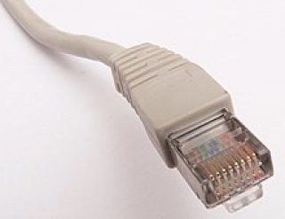

# arty_mii

| :warning: EXPERIMENTAL |
|:-----------------------|

**udp interface for host comunication - Arty7-35t only**

* Keywords: network ethernet interface udp
* NEEDS: fpga

## Pins:
*FPGA-pins*
### phy_rx_clk:

 * direction: input
 * default: F15

### phy_rxd0:

 * direction: input
 * default: D18

### phy_rxd1:

 * direction: input
 * default: E17

### phy_rxd2:

 * direction: input
 * default: E18

### phy_rxd3:

 * direction: input
 * default: G17

### phy_rx_dv:

 * direction: input
 * default: G16

### phy_rx_er:

 * direction: input
 * default: C17

### phy_tx_clk:

 * direction: input
 * default: H16

### phy_txd0:

 * direction: output
 * default: H14

### phy_txd1:

 * direction: output
 * default: J14

### phy_txd2:

 * direction: output
 * default: J13

### phy_txd3:

 * direction: output
 * default: H17

### phy_tx_en:

 * direction: output
 * default: H15

### phy_col:

 * direction: input
 * default: D17

### phy_crs:

 * direction: input
 * default: G14

### phy_ref_clk:

 * direction: output
 * default: G18

### phy_reset_n:

 * direction: output
 * default: C16

## Options:
*user-options*
### name:
name of this plugin instance

 * type: str
 * default: 

### mac:
MAC-Address

 * type: str
 * default: AA:AF:FA:CC:E3:1C

### ip:
IP-Address

 * type: str
 * default: 192.168.10.194

### port:
UDP-Port

 * type: int
 * default: 2390

## Signals:
*signals/pins in LinuxCNC*

## Interfaces:
*transport layer*

## Verilogs:
 * [sync_signal.v](sync_signal.v)
 * [ssio_sdr_in.v](ssio_sdr_in.v)
 * [mii_phy_if.v](mii_phy_if.v)
 * [eth_mac_mii_fifo.v](eth_mac_mii_fifo.v)
 * [eth_mac_mii.v](eth_mac_mii.v)
 * [eth_mac_1g.v](eth_mac_1g.v)
 * [axis_gmii_rx.v](axis_gmii_rx.v)
 * [axis_gmii_tx.v](axis_gmii_tx.v)
 * [lfsr.v](lfsr.v)
 * [eth_axis_rx.v](eth_axis_rx.v)
 * [eth_axis_tx.v](eth_axis_tx.v)
 * [udp_complete.v](udp_complete.v)
 * [udp_checksum_gen.v](udp_checksum_gen.v)
 * [udp.v](udp.v)
 * [udp_ip_rx.v](udp_ip_rx.v)
 * [udp_ip_tx.v](udp_ip_tx.v)
 * [ip_complete.v](ip_complete.v)
 * [ip.v](ip.v)
 * [ip_eth_rx.v](ip_eth_rx.v)
 * [ip_eth_tx.v](ip_eth_tx.v)
 * [ip_arb_mux.v](ip_arb_mux.v)
 * [arp.v](arp.v)
 * [arp_cache.v](arp_cache.v)
 * [arp_eth_rx.v](arp_eth_rx.v)
 * [arp_eth_tx.v](arp_eth_tx.v)
 * [eth_arb_mux.v](eth_arb_mux.v)
 * [arbiter.v](arbiter.v)
 * [priority_encoder.v](priority_encoder.v)
 * [axis_fifo.v](axis_fifo.v)
 * [axis_async_fifo.v](axis_async_fifo.v)
 * [axis_async_fifo_adapter.v](axis_async_fifo_adapter.v)
 * [sync_reset.v](sync_reset.v)
 * [arty_mii.v](arty_mii.v)
