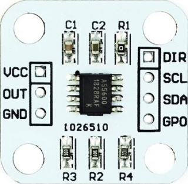

# as5600pwm



**as5600 pwm input**

scale: 4096

Keywords: absolute encoder with pwm output

## Pins:
*FPGA-pins*
### pwm:

 * direction: input


## Options:
*user-options*
### name:
name of this plugin instance

 * type: str
 * default: 


## Signals:
*signals/pins in LinuxCNC*
### angle:

 * type: float
 * direction: input
 * unit: ms

### position:

 * type: float
 * direction: input

### valid:

 * type: bit
 * direction: input


## Interfaces:
*transport layer*
### angle:

 * size: 16 bit
 * direction: input

### valid:

 * size: 1 bit
 * direction: input


## Basic-Example:
```
{
    "type": "as5600pwm",
    "pins": {
        "pwm": {
            "pin": "0"
        }
    }
}
```

## Full-Example:
```
{
    "type": "as5600pwm",
    "name": "",
    "pins": {
        "pwm": {
            "pin": "0",
            "modifiers": [
                {
                    "type": "debounce"
                }
            ]
        }
    },
    "signals": {
        "angle": {
            "net": "xxx.yyy.zzz",
            "function": "rio.xxx",
            "scale": 100.0,
            "offset": 0.0,
            "display": {
                "title": "angle",
                "section": "inputs",
                "type": "meter"
            }
        },
        "position": {
            "net": "xxx.yyy.zzz",
            "function": "rio.xxx",
            "scale": 100.0,
            "offset": 0.0,
            "display": {
                "title": "position",
                "section": "inputs",
                "type": "meter"
            }
        },
        "valid": {
            "net": "xxx.yyy.zzz",
            "function": "rio.xxx",
            "display": {
                "title": "valid",
                "section": "inputs",
                "type": "led"
            }
        }
    }
}
```

## Verilogs:
 * [as5600pwm.v](as5600pwm.v)
