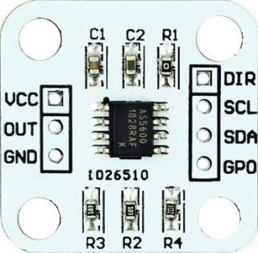

# as5600pwm

**as5600 pwm input**

scale: 4096

* Keywords: absolute encoder with pwm output
* NEEDS: fpga

## Pins:
*FPGA-pins*
### pwm:

 * direction: input

## Options:
*user-options*
### name:
name of this plugin instance

 * type: str
 * default: 

## Signals:
*signals/pins in LinuxCNC*
### angle:

 * type: float
 * direction: input

### position:

 * type: float
 * direction: input

### valid:

 * type: bit
 * direction: input

## Interfaces:
*transport layer*
### angle:

 * size: 16 bit
 * direction: input

### valid:

 * size: 1 bit
 * direction: input

## Verilogs:
 * [as5600pwm.v](as5600pwm.v)
