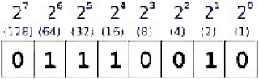

# binin

**binary to decimal input**

reads binary values

* Keywords: binary bin2dec
* NEEDS: fpga

## Pins:
*FPGA-pins*
### bin0:

 * direction: input

### bin1:

 * direction: input

### bin2:

 * direction: input

### bin3:

 * direction: input

## Options:
*user-options*
### name:
name of this plugin instance

 * type: str
 * default: 

### image:
hardware type

 * type: imgselect
 * default: generic

### bits:
number of inputs

 * type: int
 * min: 1
 * max: 32
 * default: 4
 * unit: bits

## Signals:
*signals/pins in LinuxCNC*
### value:

 * type: float
 * direction: input

## Interfaces:
*transport layer*
### value:

 * size: 8 bit
 * direction: input

