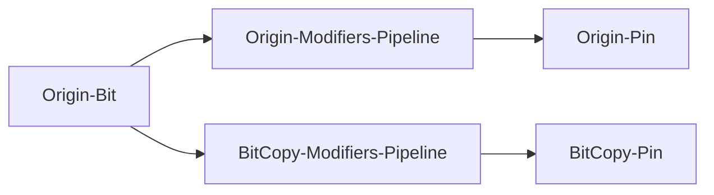

# bitcopy


**copy a bit/pin to an other output pin**

outputs a copy of a bit/pin

Usage-Examples:
* you can create an inverted pin for symetric signals (modifier: invert)
* or delayed signals for generating sequences (modifier: debounce with hight delay)
* make short signals visible (modifier: oneshot -> LED)

Keywords: pin bit copy



## Pins:
*FPGA-pins*
### bit:

 * direction: output


## Options:
*user-options*
### name:
name of this plugin instance

 * type: str
 * default: 

### origin:
Origin Bit/Pin

 * type: vpins
 * default: ERROR


## Signals:
*signals/pins in LinuxCNC*


## Interfaces:
*transport layer*


## Basic-Example:
```
{
    "type": "bitcopy",
    "pins": {
        "bit": {
            "pin": "0"
        }
    }
}
```

## Full-Example:
```
{
    "type": "bitcopy",
    "name": "",
    "origin": "ERROR",
    "pins": {
        "bit": {
            "pin": "0",
            "modifiers": [
                {
                    "type": "invert"
                }
            ]
        }
    },
    "signals": {}
}
```
