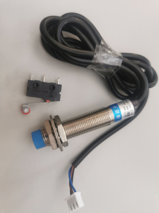

# bitin

**single input pin**

to read switches or other 1bit signals

* Keywords: switch limit estop keyboard
* NEEDS: fpga

## Pins:
*FPGA-pins*
### bit:

 * direction: input

## Options:
*user-options*
### name:
name of this plugin instance

 * type: str
 * default: 

### image:
hardware type

 * type: imgselect
 * default: generic

## Signals:
*signals/pins in LinuxCNC*
### bit:

 * type: bit
 * direction: input

## Interfaces:
*transport layer*
### bit:

 * size: 1 bit
 * direction: input

