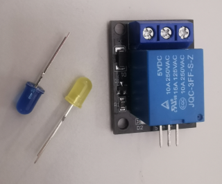

# bitout

**singe bit output pin**

to control relay, leds, valves, ....

* Keywords: led relais relay valve lamp motor magnet
* NEEDS: fpga

## Pins:
*FPGA-pins*
### bit:

 * direction: output

## Options:
*user-options*
### name:
name of this plugin instance

 * type: str
 * default: 

### image:
hardware type

 * type: imgselect
 * default: generic

## Signals:
*signals/pins in LinuxCNC*
### bit:

 * type: bit
 * direction: output

## Interfaces:
*transport layer*
### bit:

 * size: 1 bit
 * direction: output

