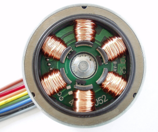

# bldc



**BLDC FOC**

to control BLDC Motors - experimental

Keywords: joint brushless

## Pins:
*FPGA-pins*
### u:

 * direction: output

### v:

 * direction: output

### w:

 * direction: output

### en:

 * direction: output


## Options:
*user-options*
### frequency:
PWM frequency

 * type: int
 * min: 10
 * max: 1000000
 * default: 10000
 * unit: Hz

### halsensor:
encoder instance

 * type: str
 * default: 
 * unit: 

### name:
name of this plugin instance

 * type: str
 * default: 

### axis:
axis name (X,Y,Z,...)

 * type: select
 * default: None

### is_joint:
configure as joint

 * type: bool
 * default: False


## Signals:
*signals/pins in LinuxCNC*
### velocity:

 * type: float
 * direction: output
 * min: -100
 * max: 100
 * unit: %

### offset:

 * type: float
 * direction: output
 * min: -15
 * max: 15
 * unit: %

### torque:

 * type: float
 * direction: output
 * min: 0
 * max: 15
 * unit: 

### enable:

 * type: bit
 * direction: output


## Interfaces:
*transport layer*
### velocity:

 * size: 16 bit
 * direction: output

### offset:

 * size: 8 bit
 * direction: output

### torque:

 * size: 8 bit
 * direction: output

### enable:

 * size: 1 bit
 * direction: output


## Basic-Example:
```
{
    "type": "bldc",
    "pins": {
        "u": {
            "pin": "0"
        },
        "v": {
            "pin": "1"
        },
        "w": {
            "pin": "2"
        },
        "en": {
            "pin": "3"
        }
    }
}
```

## Full-Example:
```
{
    "type": "bldc",
    "frequency": 10000,
    "halsensor": "",
    "name": "",
    "axis": "",
    "is_joint": false,
    "pins": {
        "u": {
            "pin": "0",
            "modifiers": [
                {
                    "type": "invert"
                }
            ]
        },
        "v": {
            "pin": "1",
            "modifiers": [
                {
                    "type": "invert"
                }
            ]
        },
        "w": {
            "pin": "2",
            "modifiers": [
                {
                    "type": "invert"
                }
            ]
        },
        "en": {
            "pin": "3",
            "modifiers": [
                {
                    "type": "invert"
                }
            ]
        }
    },
    "signals": {
        "velocity": {
            "net": "xxx.yyy.zzz",
            "function": "rio.xxx",
            "scale": 100.0,
            "offset": 0.0,
            "display": {
                "title": "velocity",
                "section": "outputs",
                "type": "scale"
            }
        },
        "offset": {
            "net": "xxx.yyy.zzz",
            "function": "rio.xxx",
            "scale": 100.0,
            "offset": 0.0,
            "display": {
                "title": "offset",
                "section": "outputs",
                "type": "scale"
            }
        },
        "torque": {
            "net": "xxx.yyy.zzz",
            "function": "rio.xxx",
            "scale": 100.0,
            "offset": 0.0,
            "display": {
                "title": "torque",
                "section": "outputs",
                "type": "scale"
            }
        },
        "enable": {
            "net": "xxx.yyy.zzz",
            "function": "rio.xxx",
            "display": {
                "title": "enable",
                "section": "outputs",
                "type": "checkbox"
            }
        }
    }
}
```

## Verilogs:
 * [bldc.v](bldc.v)
