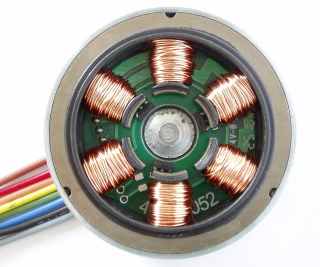

# bldc




| :warning: EXPERIMENTAL |
|:-----------------------|

**BLDC FOC**

to control BLDC Motors

Motor-Setup:
* set motor poles and encoder resolution in the options
* start rio-test gui
* set mode to calibration (2)
* set enable
* set velocity to ~30% (warning: motor will start to spin !)
* adjust the offset until the motor stop's (should between -15<->15)
* add the offset value to your json config
```
    "signals": {
        "offset": {
            "setp": "-11"
        }
    }
```

Unitec DTBL-2714A: 4pol
Rexroth MSM031C-0300-NN-M0-CH0: 4pol
Yas: 3pol

* Keywords: joint brushless
* NEEDS: fpga

## Pins:
*FPGA-pins*
### u_p:

 * direction: output

### v_p:

 * direction: output

### w_p:

 * direction: output

### u_n:

 * direction: output
 * optional: True

### v_n:

 * direction: output
 * optional: True

### w_n:

 * direction: output
 * optional: True

### en:

 * direction: output
 * optional: True


## Options:
*user-options*
### name:
name of this plugin instance

 * type: str
 * default: 

### is_joint:
configure as joint

 * type: bool
 * default: True

### axis:
axis name (X,Y,Z,...)

 * type: select
 * default: None
 * options: X, Y, Z, A, B, C, U, V, W

### image:
hardware type

 * type: imgselect
 * default: generic

### frequency:
PWM frequency

 * type: int
 * min: 10
 * max: 200000
 * default: 50000
 * unit: Hz

### halsensor:
encoder instance

 * type: sigselect
 * default: 
 * unit: 

### poles:
motor poles

 * type: int
 * min: 2
 * max: 100
 * default: 4
 * unit: 

### sine_len:
sinus table lenght in bits (0 = auto)

 * type: int
 * min: 0
 * max: 12
 * default: 0
 * unit: bits

### sine_res:
sinus table lenght in bits

 * type: int
 * min: 8
 * max: 16
 * default: 8
 * unit: bits

### feedback_res:
encoder resolution

 * type: int
 * min: 10
 * max: 65536
 * default: 4096
 * unit: 


## Signals:
*signals/pins in LinuxCNC*
### velocity:

 * type: float
 * direction: output
 * min: -255
 * max: 255
 * unit: %

### offset:

 * type: float
 * direction: output
 * min: -256
 * max: 256
 * unit: 

### enable:

 * type: bit
 * direction: output

### mode:

 * type: float
 * direction: output
 * min: 0
 * max: 2

### preset:

 * type: float
 * direction: output
 * min: 0
 * max: 255


## Interfaces:
*transport layer*
### velocity:

 * size: 16 bit
 * direction: output

### offset:

 * size: 16 bit
 * direction: output
 * multiplexed: True

### enable:

 * size: 1 bit
 * direction: output

### mode:

 * size: 8 bit
 * direction: output
 * multiplexed: True

### preset:

 * size: 8 bit
 * direction: output
 * multiplexed: True


## Verilogs:
 * [bldc.v](bldc.v)
