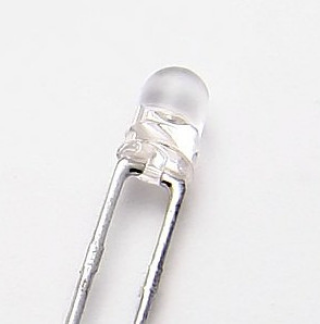

# blink

**blinking output pin**

outputs a fixed frequency / was used to indicate that the FPGA is runing / no control signals

* Keywords: led blinking
* NEEDS: fpga

## Pins:
*FPGA-pins*
### led:

 * direction: output

## Options:
*user-options*
### name:
name of this plugin instance

 * type: str
 * default: 

### image:
hardware type

 * type: imgselect
 * default: generic

### frequency:
blink frequency in Hz

 * type: float
 * default: 1.0
 * unit: Hz

## Signals:
*signals/pins in LinuxCNC*

## Interfaces:
*transport layer*

## Verilogs:
 * [blink.v](blink.v)
