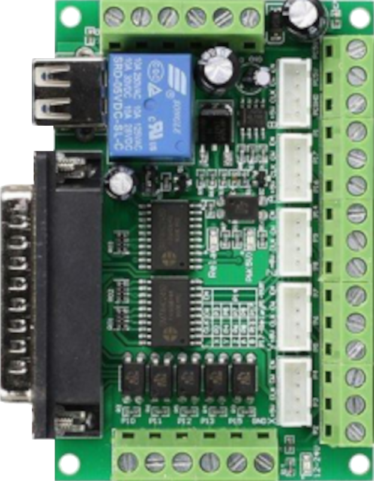
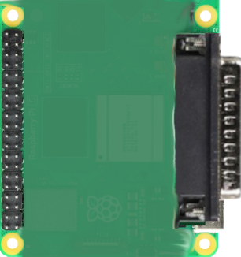
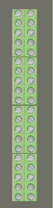
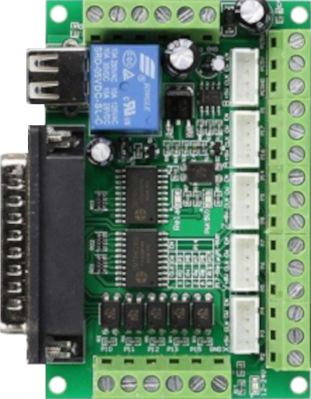
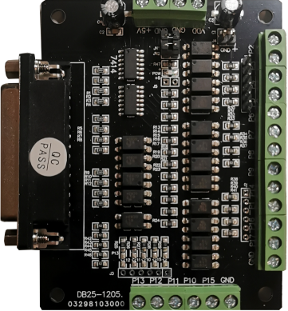
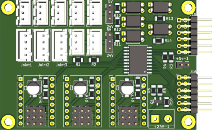

# breakout

**5Axis China-BOB**

* NEEDS: db25

## Node-Types
| Name | Image |
| --- | --- |
| rioctrl-shiftio |  |
| rpi-db25hat |  |
| rioctrl-quadenc4 |  |
| rioctrl-stepdir |  |
| china-bob5x |  |
| db25-1205 |  |
| rio-icebreaker3x |  |

## Pins:
*FPGA-pins*
### SLOT:P1:

 * direction: all
 * optional: True

### SLOT:P2:

 * direction: all
 * optional: True

### SLOT:P3:

 * direction: all
 * optional: True

### SLOT:P4:

 * direction: all
 * optional: True

### SLOT:P5:

 * direction: all
 * optional: True

### SLOT:P6:

 * direction: all
 * optional: True

### SLOT:P7:

 * direction: all
 * optional: True

### SLOT:P8:

 * direction: all
 * optional: True

### SLOT:P9:

 * direction: all
 * optional: True

### SLOT:P10:

 * direction: all
 * optional: True

### SLOT:P11:

 * direction: all
 * optional: True

### SLOT:P12:

 * direction: all
 * optional: True

### SLOT:P13:

 * direction: all
 * optional: True

### SLOT:P14:

 * direction: all
 * optional: True

### SLOT:P15:

 * direction: all
 * optional: True

### SLOT:P16:

 * direction: all
 * optional: True

### SLOT:P17:

 * direction: all
 * optional: True

### OPTO:in0:

 * direction: input
 * optional: True

### OPTO:in1:

 * direction: input
 * optional: True

### OPTO:in2:

 * direction: input
 * optional: True

### OPTO:in3:

 * direction: input
 * optional: True

### OPTO:in4:

 * direction: input
 * optional: True

### RELAIS:out:

 * direction: output
 * optional: True

### POWER:5V_1:

 * direction: none
 * optional: True

### POWER:5V_2:

 * direction: none
 * optional: True

### POWER:GND:

 * direction: none
 * optional: True

### POWER:F_GND_1:

 * direction: none
 * optional: True

### POWER:F_GND_2:

 * direction: none
 * optional: True

### POWER:F_24V:

 * direction: none
 * optional: True

### POWER:F_GND_3:

 * direction: none
 * optional: True

### PWM:analog:

 * direction: output
 * optional: True

### PWM:digital:

 * direction: output
 * optional: True

### B:dir:

 * direction: output
 * optional: True

### B:step:

 * direction: output
 * optional: True

### ALL:en:

 * direction: output
 * optional: True

### A:dir:

 * direction: output
 * optional: True

### A:step:

 * direction: output
 * optional: True

### Z:dir:

 * direction: output
 * optional: True

### Z:step:

 * direction: output
 * optional: True

### Y:dir:

 * direction: output
 * optional: True

### Y:step:

 * direction: output
 * optional: True

### X:dir:

 * direction: output
 * optional: True

### X:step:

 * direction: output
 * optional: True

## Options:
*user-options*
### name:
name of this plugin instance

 * type: str
 * default: 

### node_type:
board type

 * type: select
 * default: china-bob5x
 * options: rioctrl-shiftio, rpi-db25hat, rioctrl-quadenc4, rioctrl-stepdir, china-bob5x, db25-1205, rio-icebreaker3x

## Signals:
*signals/pins in LinuxCNC*

## Interfaces:
*transport layer*

