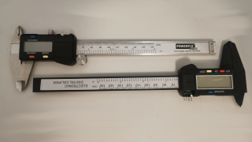

# caliper



**reading position from cheap calipers**

* rate: ~8Hz (123ms)
* too slow for joint feedback

warning, there are different protocols

and also some without output

both on the image are working

## Pins:
*FPGA-pins*
### data:

 * direction: input

### clock:

 * direction: input


## Options:
*user-options*
### name:
name of this plugin instance

 * type: str
 * default: 


## Signals:
*signals/pins in LinuxCNC*
### position:

 * type: float
 * direction: input
 * unit: mm

### mode:

 * type: bit
 * direction: input
 * unit: mm/inch


## Interfaces:
*transport layer*
### position:

 * size: 24 bit
 * direction: input

### mode:

 * size: 1 bit
 * direction: input


## Basic-Example:
```
{
    "type": "caliper",
    "pins": {
        "data": {
            "pin": "0"
        },
        "clock": {
            "pin": "1"
        }
    }
}
```

## Full-Example:
```
{
    "type": "caliper",
    "name": "",
    "pins": {
        "data": {
            "pin": "0",
            "modifiers": [
                {
                    "type": "debounce"
                }
            ]
        },
        "clock": {
            "pin": "1",
            "modifiers": [
                {
                    "type": "debounce"
                },
                {
                    "type": "invert"
                }
            ]
        }
    },
    "signals": {
        "position": {
            "net": "xxx.yyy.zzz",
            "function": "rio.xxx",
            "scale": 100.0,
            "offset": 0.0,
            "display": {
                "title": "position",
                "section": "inputs",
                "type": "meter"
            }
        },
        "mode": {
            "net": "xxx.yyy.zzz",
            "function": "rio.xxx",
            "display": {
                "title": "mode",
                "section": "inputs",
                "type": "led"
            }
        }
    }
}
```

## Verilogs:
 * [caliper.v](caliper.v)
