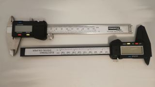

# caliper

**reading position from cheap calipers**

* rate: ~8Hz (123ms)
* too slow for joint feedback

warning, there are different protocols

and also some without output

both on the image are working

* NEEDS: fpga

## Pins:
*FPGA-pins*
### data:

 * direction: input

### clock:

 * direction: input

## Options:
*user-options*
### name:
name of this plugin instance

 * type: str
 * default: 

## Signals:
*signals/pins in LinuxCNC*
### position:

 * type: float
 * direction: input
 * unit: mm

### mode:

 * type: bit
 * direction: input
 * unit: mm/inch

## Interfaces:
*transport layer*
### position:

 * size: 24 bit
 * direction: input

### mode:

 * size: 1 bit
 * direction: input

## Verilogs:
 * [caliper.v](caliper.v)
