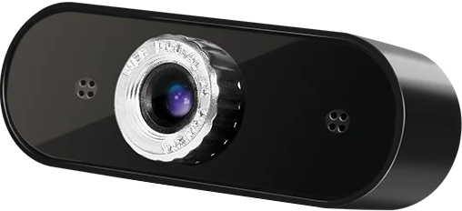

# camjog

**gui component to jog via camera image**

* Keywords: jog gui robot

## Pins:
*FPGA-pins*

## Options:
*user-options*
### name:
name of this plugin instance

 * type: str
 * default: 

### image:
hardware type

 * type: imgselect
 * default: generic

### device:

 * type: str
 * default: /dev/video0

### width:

 * type: int
 * default: 640

### height:

 * type: int
 * default: 480

### scale:

 * type: float
 * default: 1.0

### tabname:

 * type: str
 * default: camjog

### external:

 * type: bool
 * default: False

## Signals:
*signals/pins in LinuxCNC*

## Interfaces:
*transport layer*

