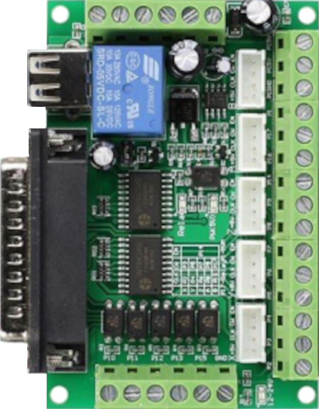

# shiftreg



**Expansion to add I/O's via shiftregister's**

do not use this for high frequency signals !!!

jitter measured with a EPM240 as 40bit Shiftreg:
```
@10Mhz clock and 5 byte data ~= 3.7us jitter
```

## Output-Expansion with 74HC595:

| Plugin | 74HC595 | FUNC | LABEL |
| --- | --- | --- | --- |
| out | 14 | DS | SER_IN |
| in | | | |
| sclk | 11 | SH_CP / SRCLK | Clock |
| load | 12 | ST_CP / RCLK | L_Clock |

## Input-Expansion with 74HC165:

| Plugin | 74HC165 | FUNC | LABEL |
| --- | --- | --- | --- |
| out | | | |
| in |  | SER | SER_OUT |
| sclk | 2 | CLK | CLK |
| load |  | SH/LD | SH/LD |

### LinuxCNC-RIO with Unipolar Stepper's over Shiftreg to the FPGA
[](https://www.youtube.com/shorts/NlLd5CRCOac "LinuxCNC-RIO with Unipolar Stepper's over Shiftreg to the FPGA")

Keywords: expansion digital io

## Pins:
*FPGA-pins*
### out:
output data (DS on 74HC595)

 * direction: output
 * optional: True

### in:
input data (SER_OUT on 74HC165)

 * direction: input
 * optional: True

### sclk:
input data (CLK on 74HC165/ CH_CP/SRCLK on 74HC595)

 * direction: output

### load:
input data (SH/LD on 74HC165/ ST_CP/RCLK on 74HC595)

 * direction: output


## Options:
*user-options*
### name:
name of this plugin instance

 * type: str
 * default: 

### speed:
interface clock

 * type: int
 * min: 100000
 * max: 10000000
 * default: 1000000

### bits:
number of bits (IO's)

 * type: int
 * min: 8
 * max: 1024
 * default: 8


## Signals:
*signals/pins in LinuxCNC*


## Interfaces:
*transport layer*


## Basic-Example:
```
{
    "type": "shiftreg",
    "pins": {
        "out": {
            "pin": "0"
        },
        "in": {
            "pin": "1"
        },
        "sclk": {
            "pin": "2"
        },
        "load": {
            "pin": "3"
        }
    }
}
```

## Full-Example:
```
{
    "type": "shiftreg",
    "name": "",
    "speed": 1000000,
    "bits": 8,
    "pins": {
        "out": {
            "pin": "0",
            "modifiers": [
                {
                    "type": "invert"
                }
            ]
        },
        "in": {
            "pin": "1",
            "modifiers": [
                {
                    "type": "debounce"
                },
                {
                    "type": "invert"
                }
            ]
        },
        "sclk": {
            "pin": "2",
            "modifiers": [
                {
                    "type": "invert"
                }
            ]
        },
        "load": {
            "pin": "3",
            "modifiers": [
                {
                    "type": "invert"
                }
            ]
        }
    },
    "signals": {}
}
```

## Verilogs:
 * [shiftreg.v](shiftreg.v)
