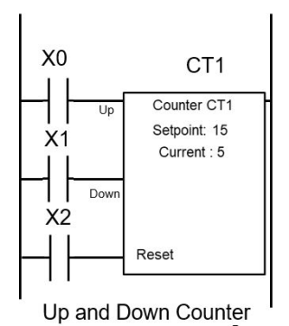

# counter

**pulse counter input**

to counting digital pulses, supporting up,down and reset signals

* Keywords: counter pulse
* NEEDS: fpga

## Pins:
*FPGA-pins*
### up:
increment pin

 * direction: input
 * optional: True

### down:
decrement pin

 * direction: input
 * optional: True

### reset:
reset to zero pin

 * direction: input
 * optional: True

## Options:
*user-options*
### name:
name of this plugin instance

 * type: str
 * default: 

### image:
hardware type

 * type: imgselect
 * default: generic

## Signals:
*signals/pins in LinuxCNC*
### counter:

 * type: float
 * direction: input

## Interfaces:
*transport layer*
### counter:

 * size: 32 bit
 * direction: input

## Verilogs:
 * [counter.v](counter.v)
