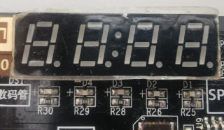

# dis7seg

**7segment display with buttons**

only usable for devboards with 7segment display / better using other 7seg plugins

* Keywords: info display
* NEEDS: fpga

## Pins:
*FPGA-pins*
### en1:

 * direction: output

### en2:

 * direction: output

### en3:

 * direction: output

### en4:

 * direction: output

### seg_a:

 * direction: output
 * optional: True

### seg_b:

 * direction: output
 * optional: True

### seg_c:

 * direction: output
 * optional: True

### seg_d:

 * direction: output
 * optional: True

### seg_e:

 * direction: output
 * optional: True

### seg_f:

 * direction: output
 * optional: True

### seg_g:

 * direction: output
 * optional: True

## Options:
*user-options*
### name:
name of this plugin instance

 * type: str
 * default: 

## Signals:
*signals/pins in LinuxCNC*
### value:
number to display

 * type: float
 * direction: output
 * min: 0
 * max: 9999

## Interfaces:
*transport layer*
### value:

 * size: 16 bit
 * direction: output
 * multiplexed: True

## Verilogs:
 * [dis7seg.v](dis7seg.v)
