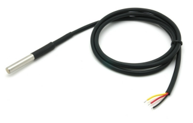

# ds18b20

**1Wire Temperature sensor**

for cheap 1wire temperature sensor's, only one per pin is supported at the moment

* Keywords: adc analog temperature
* NEEDS: fpga

## Pins:
*FPGA-pins*
### one_wire:

 * direction: inout

## Options:
*user-options*
### name:
name of this plugin instance

 * type: str
 * default: 

### image:
hardware type

 * type: imgselect
 * default: generic

## Signals:
*signals/pins in LinuxCNC*
### temperature:

 * type: float
 * direction: input
 * unit: Hz

## Interfaces:
*transport layer*
### temperature:

 * size: 16 bit
 * direction: input

## Verilogs:
 * [ds18b20.v](ds18b20.v)
