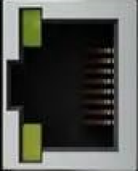

# ethercat

| :warning: EXPERIMENTAL |
|:-----------------------|

**Ethercat - Master**

* Keywords: stepper servo master
* PROVIDES: ethercat, gpio, base

## Node-Types
| Name | Image |
| --- | --- |
| Master | - |
| Servo/Stepper | - |
| GPIO | - |
| ek1100 | - |
| el1008 | - |
| el2008 | - |
| el7411 | - |

## Pins:
*FPGA-pins*
### BUS:out:

 * direction: all

## Options:
*user-options*
### name:
name of this plugin instance

 * type: str
 * default: 

### node_type:
Type

 * type: select
 * default: Master
 * options: Master, Servo/Stepper, GPIO, ek1100, el1008, el2008, el7411

## Signals:
*signals/pins in LinuxCNC*

## Interfaces:
*transport layer*

