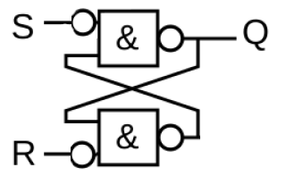

# flipflop_in

**flipflop input**

set and reset an input bit

* Keywords: sr-flipflop
* NEEDS: fpga

## Pins:
*FPGA-pins*
### setbit:

 * direction: input

### reset:

 * direction: input

## Options:
*user-options*
### name:
name of this plugin instance

 * type: str
 * default: 

### image:
hardware type

 * type: imgselect
 * default: generic

### default:
default value after startup

 * type: bool
 * default: 0
 * unit: 

## Signals:
*signals/pins in LinuxCNC*
### outbit:

 * type: float
 * direction: input

## Interfaces:
*transport layer*
### outbit:

 * size: 1 bit
 * direction: input

## Verilogs:
 * [flipflop_in.v](flipflop_in.v)
