# BOARDS
| Name | clock | Toolchain | Description | Image |
| --- | --- | --- | --- | --- |
| Altera10M08Eval | 50.00Mhz | quartus | Altera10M08Eval - Evaluation Kit | 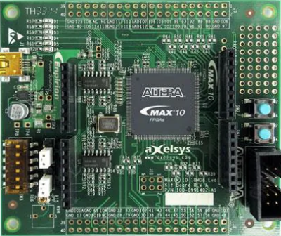 |
| Basys2 | 50.00Mhz | ise | Digilent - Basys2 | 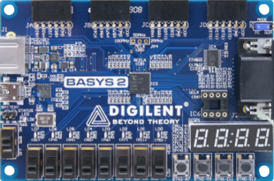 |
| CYC1000 | 48.00Mhz | quartus | TEI0003 | 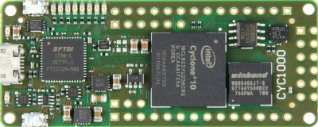 |
| Colorlight5A-75B-v8.0 | 25.00Mhz | icestorm | Lattice ECP5 board | 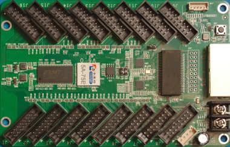 |
| Colorlight5A-75E | 25.00Mhz | icestorm | Lattice ECP5 board | 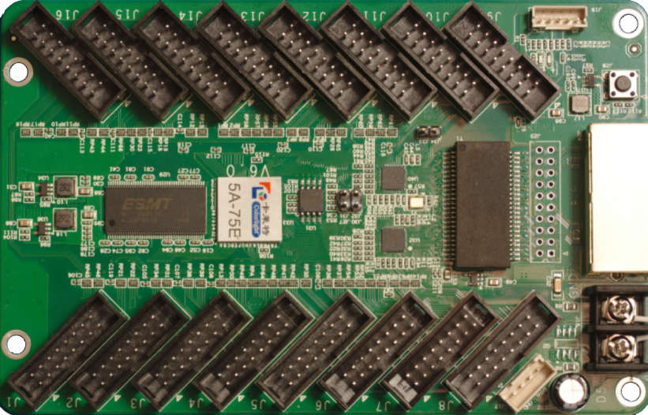 |
| Colorlight_i5-v7_0 | 25.00Mhz | icestorm | Lattice ECP5 on SODIMM-200P board | 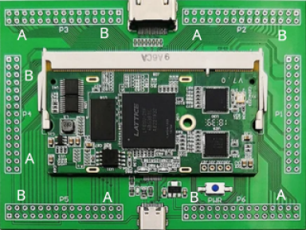 |
| EBAZ4205 | 150.00Mhz | vivado | EBAZ4205 - WIP | 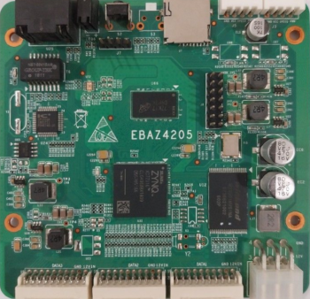 |
| ECP5-256 | 100.00Mhz | icestorm | Lattice ECP5 devboard | 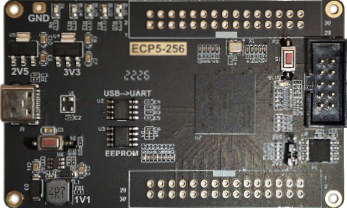 |
| EP2C5T144 | 50.00Mhz | quartus | EP2C5T144 dev-board - untested - for this board, you need an older quartus toolchain (quartus-ii-web-edition 13-0sp1) | 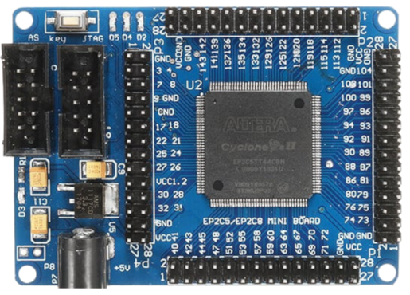 |
| EP4CE6E22C8 | 100.00Mhz | quartus | EP4CE6E22C8 devboard | 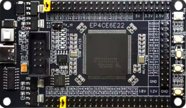 |
| ICEBreakerV1.0e | 30.00Mhz | icestorm | Small and low cost FPGA educational and development board | 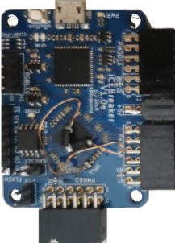 |
| ICESugarNano | 12.00Mhz | icestorm | ICESugarNano - usable as sat only | 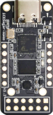 |
| ICESugarPro | 25.00Mhz | icestorm | Lattice ECP5 on SODIMM-200P board | 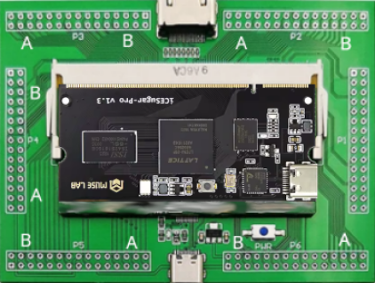 |
| IceShield | 29.81Mhz | icestorm | RIO-IceShield board for Raspberry PI4 | 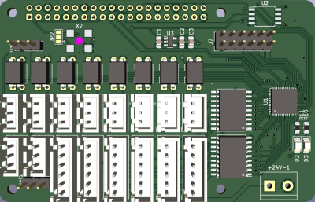 |
| LX9MicroBoard | 100.00Mhz | ise | LX9MicroBoard - Spartan6 devboard on my debian12, it works with openFPGAloader - linux usb flashtool: Adept 2 | 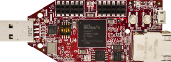 |
| Mesa7c80 | 100.00Mhz | ise | Mesa7c80 over SPI - untested, i have no hardware | 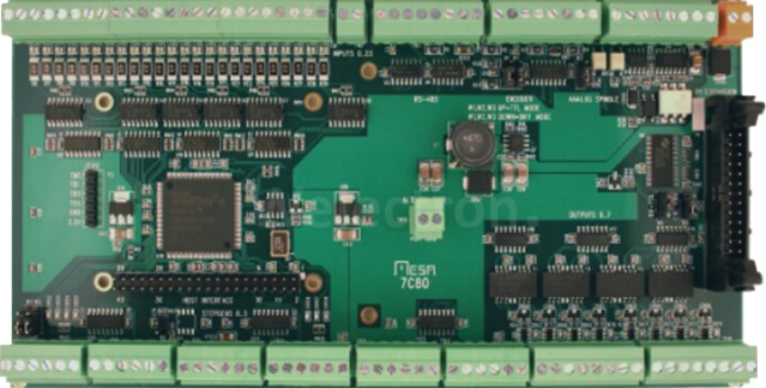 |
| Mesa7c81 | 100.00Mhz | ise | Mesa7c81 over SPI - WIP | 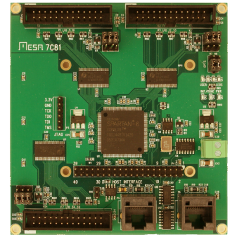 |
| MotoMan | 60.00Mhz | icestorm | RIO-MotoMan board | 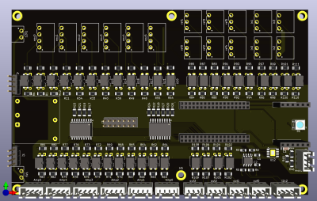 |
| Numato-Spartan6 | 50.00Mhz | ise | Spartan6 - only for testing the toolchain | 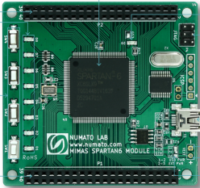 |
| OctoBot | 60.00Mhz | icestorm | RIO-OctoBot board | 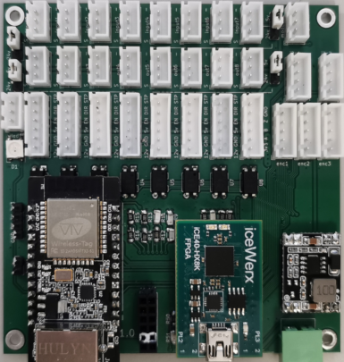 |
| Olimex-ICE40HX8K-EVB | 100.00Mhz | icestorm | ICE40HX8K FPGA development board | 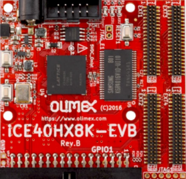 |
| TangNano1K | 27.00Mhz | gowin (icestorm) | TangNano1K - cheap GW1NR-1 Devboard - usable as sat only | 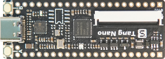 |
| TangNano20K | 27.00Mhz | gowin (icestorm) | TangNano20K - GW2AR-18 devboard | 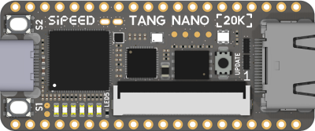 |
| TangNano9K | 27.00Mhz | gowin (icestorm) | TangNano9K - cheap GW1NR-9 Devboard | 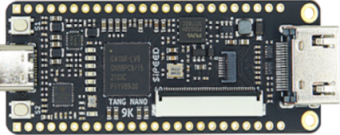 |
| TangPrimer20K | 27.00Mhz | gowin (icestorm) | TangPrimer20K-Devboard on Dock ext-board | 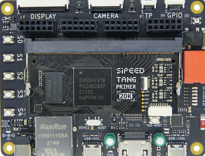 |
| TangPrimer25K | 50.00Mhz | gowin (icestorm) | TangPrimer25K-Devboard on Dev-Board | 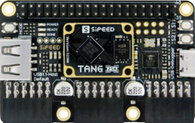 |
| Tangbob | 27.00Mhz | gowin (icestorm) | TangNano9K - cheap GW1NR-9 Devboard | 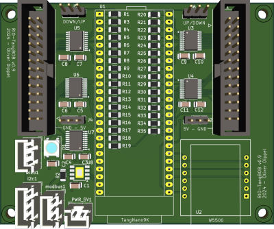 |
| Tangoboard | 27.00Mhz | gowin (icestorm) | based on TangNano9k | 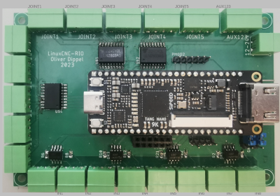 |
| rioctrl | 100.00Mhz | icestorm | rioctrl- a modular hardware for riocore | 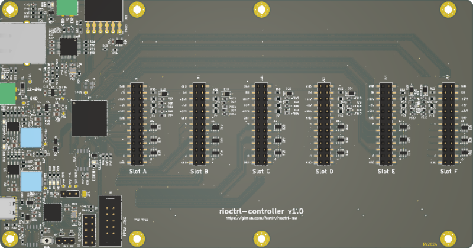 |
