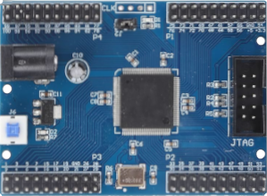
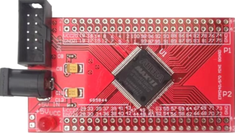
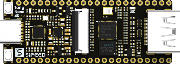

# fpga
**fpga board**

fpga

* Keywords: fpga board
* PROVIDES: fpga, base

## Node-Types
| Name | Image |
| --- | --- |
| Altera10M08Eval |  |
| Basys2 |  |
| CYC1000 |  |
| Colorlight5A-75B-v8.0 |  |
| Colorlight5A-75E |  |
| Colorlight_i5-v7_0 |  |
| EBAZ4205 |  |
| ECP5-256 |  |
| EP2C5T144 |  |
| EP4CE6E22C8 |  |
| EPM240 |  |
| EPM240mini |  |
| ICEBreakerV1.0e |  |
| ICESugarNano |  |
| ICESugarPro |  |
| IceShield |  |
| LX9MicroBoard |  |
| Mesa7c80 |  |
| Mesa7c81 |  |
| MotoMan |  |
| Numato-Spartan6 |  |
| OctoBot |  |
| Olimex-ICE40HX8K-EVB |  |
| TangNano1K |  |
| TangNano20K |  |
| TangNano4K |  |
| TangNano9K |  |
| TangPrimer20K |  |
| TangPrimer25K |  |
| Tangbob |  |
| Tangbob-noudp |  |
| Tangoboard |  |
| rioctrl |  |

## Pins:
*FPGA-pins*

## Options:
*user-options*
### name:
name of this plugin instance

 * type: str
 * default: 

### image:
hardware type

 * type: imgselect
 * default: generic

### node_type:
board type

 * type: select
 * default: 
 * options: Altera10M08Eval, Basys2, CYC1000, Colorlight5A-75B-v8.0, Colorlight5A-75E, Colorlight_i5-v7_0, EBAZ4205, ECP5-256, EP2C5T144, EP4CE6E22C8, EPM240, EPM240mini, ICEBreakerV1.0e, ICESugarNano, ICESugarPro, IceShield, LX9MicroBoard, Mesa7c80, Mesa7c81, MotoMan, Numato-Spartan6, OctoBot, Olimex-ICE40HX8K-EVB, TangNano1K, TangNano20K, TangNano4K, TangNano9K, TangPrimer20K, TangPrimer25K, Tangbob, Tangbob-noudp, Tangoboard, rioctrl

### simulation:
simulation mode

 * type: bool
 * default: False

## Signals:
*signals/pins in LinuxCNC*

## Interfaces:
*transport layer*

