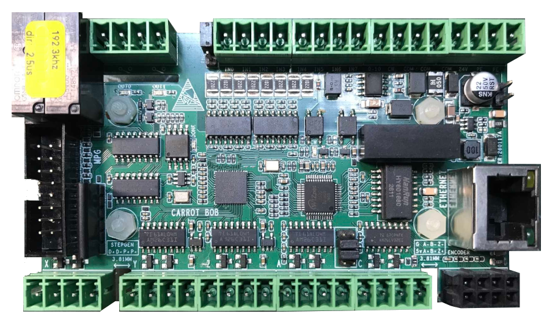

# CarrotBob

ICE40up5k based board - by DirtyBee

| Name | Value |
| --- | --- |
| Family | ice40 |
| Type | up5k |
| Clock | 30.0 |
| Toolchain | icestorm |
| URL | [link](https://github.com/TimBBB/DirtyBee-Carrot-BOB) |

## Slots
### RELAIS

| Name | Pin | Direction |
| --- | --- | --- |
| OUT0 | 36 | output |
| OUT1 | 37 | output |

### JOINT0

| Name | Pin | Direction |
| --- | --- | --- |
| STEP | 44 | output |
| DIR | 43 | output |

### JOINT1

| Name | Pin | Direction |
| --- | --- | --- |
| STEP | 42 | output |
| DIR | 45 | output |

### JOINT2

| Name | Pin | Direction |
| --- | --- | --- |
| STEP | 48 | output |
| DIR | 47 | output |

### JOINT3

| Name | Pin | Direction |
| --- | --- | --- |
| STEP | 46 | output |
| DIR | 2 | output |

### JOINT4

| Name | Pin | Direction |
| --- | --- | --- |
| STEP | 4 | output |
| DIR | 3 | output |

### PWR

| Name | Pin | Direction |
| --- | --- | --- |
| GND_0 | GND | input |
| GND_1 | GND | input |
| GND_2 | GND | input |
| 24V | 24V | input |
| PE_0 | PE | input |
| PE_1 | PE | input |

### SPINDLE

| Name | Pin | Direction |
| --- | --- | --- |
| OUT | 0-10V | output |
| CW | CW | output |

### ENC0

| Name | Pin | Direction |
| --- | --- | --- |
| A | 39 | input |
| B | 40 | input |
| Z | 41 | input |

### IO

| Name | Pin | Direction |
| --- | --- | --- |
| IN0 | 28 | input |
| IN1 | 27 | input |
| IN2 | 26 | input |
| IN3 | 25 | input |
| IN4 | 23 | input |
| IN5 | 21 | input |
| IN6 | 20 | input |
| IN7 | 6 | input |

### MPG

| Name | Pin | Direction |
| --- | --- | --- |
| ESTOP | shiftreg:INPUT:9 | input |
| X10 | shiftreg:INPUT:0 | input |
| 6 |  | input |
| A | shiftreg:INPUT:2 | input |
| Y | shiftreg:INPUT:6 | input |
| JOG_B | shiftreg:INPUT:5 | input |
| JOG_A | shiftreg:INPUT:10 | input |
| GND | GND | input |
| X100 | shiftreg:INPUT:1 | input |
| X1 | shiftreg:INPUT:3 | input |
| C | shiftreg:INPUT:7 | input |
| Z | shiftreg:INPUT:4 | input |
| X | shiftreg:INPUT:11 | input |
| GND_2 | GND | output |
| ENC_PWR | 5V | output |

