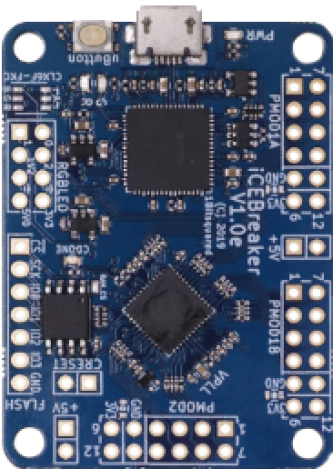

# ICEBreakerV1.0e

Small and low cost FPGA educational and development board

| Name | Value |
| --- | --- |
| Family | ice40 |
| Type | up5k |
| Clock | 30.0 |
| Toolchain | icestorm |
| URL | [link](https://github.com/icebreaker-fpga/icebreaker) |

## Slots
### UART
USB UART

| Name | Pin | Direction |
| --- | --- | --- |
| RX | 6 | input |
| TX | 9 | output |

### LED
LED

| Name | Pin | Direction |
| --- | --- | --- |
| R | 11 |  |
| G | 37 |  |

### BUTTON
BUTTON

| Name | Pin | Direction |
| --- | --- | --- |
| 1 | 10 |  |

### RGB

| Name | Pin | Direction |
| --- | --- | --- |
| GRN | 40 | all |
| RED | 39 | all |
| BLU | 41 | all |
| 1V5 | 1V5 | all |
| 3V3 | 3V3 | all |
| 5V | 5V | all |
| GND_1 | GND | all |
| GND_2 | GND | all |

### SPI
SPI

| Name | Pin | Direction |
| --- | --- | --- |
| FLASH_CS | 16 | all |
| SCLK | 15 | all |
| MISO | 17 | all |
| MOSI | 14 | all |
| SEL | 12 | all |
| IO3 | 13 | all |
| GND_1 | GND | all |
| GND_2 | GND | all |
| RST | RST | all |

### PWR

| Name | Pin | Direction |
| --- | --- | --- |
| 5V_1 | 5V | all |
| GND_1 | GND | all |
| 5V_2 | 5V | all |
| GND_2 | GND | all |

### PMOD1A
PMOD 1A

| Name | Pin | Direction |
| --- | --- | --- |
| P1 | 4 |  |
| P2 | 2 |  |
| P3 | 47 |  |
| P4 | 45 |  |
| P7 | 3 |  |
| P8 | 48 |  |
| P9 | 46 |  |
| P10 | 44 |  |
| GND_1 | GND | all |
| GND_2 | GND | all |
| 3V3_1 | 3V3 | all |
| 3V3_2 | 3V3 | all |

### PMOD1B
PMOD 1B

| Name | Pin | Direction |
| --- | --- | --- |
| P1 | 43 |  |
| P2 | 38 |  |
| P3 | 34 |  |
| P4 | 31 |  |
| P7 | 42 |  |
| P8 | 36 |  |
| P9 | 32 |  |
| P10 | 28 |  |
| GND_1 | GND | all |
| GND_2 | GND | all |
| 3V3_1 | 3V3 | all |
| 3V3_2 | 3V3 | all |

### PMOD2
PMOD2

| Name | Pin | Direction |
| --- | --- | --- |
| P1 | 27 |  |
| P2 | 25 |  |
| P3 | 21 |  |
| P4 | 19 |  |
| P7 | 26 |  |
| P8 | 23 |  |
| P9 | 20 |  |
| P10 | 18 |  |
| GND_1 | GND | all |
| GND_2 | GND | all |
| 3V3_1 | 3V3 | all |
| 3V3_2 | 3V3 | all |

